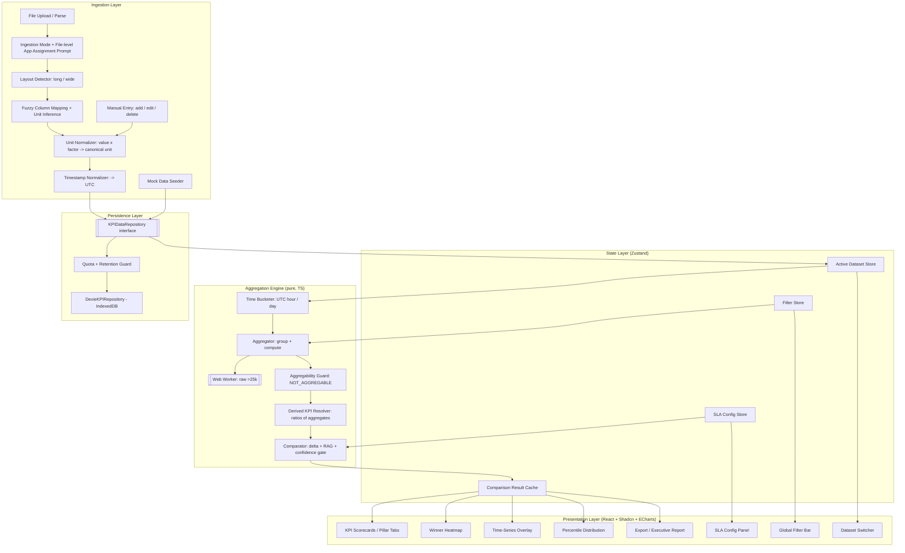
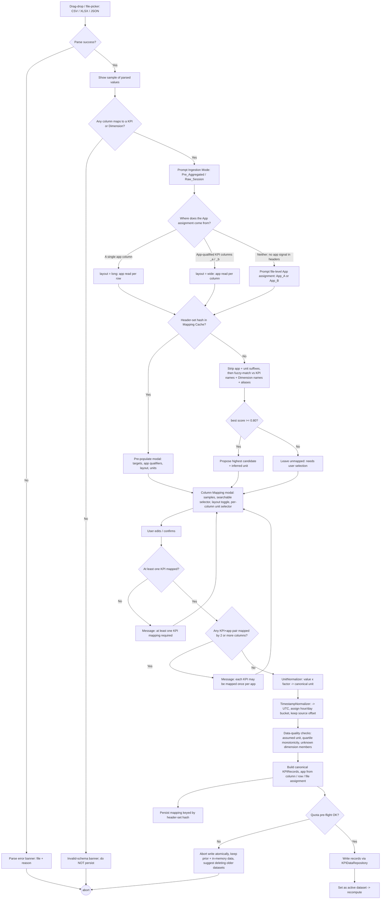
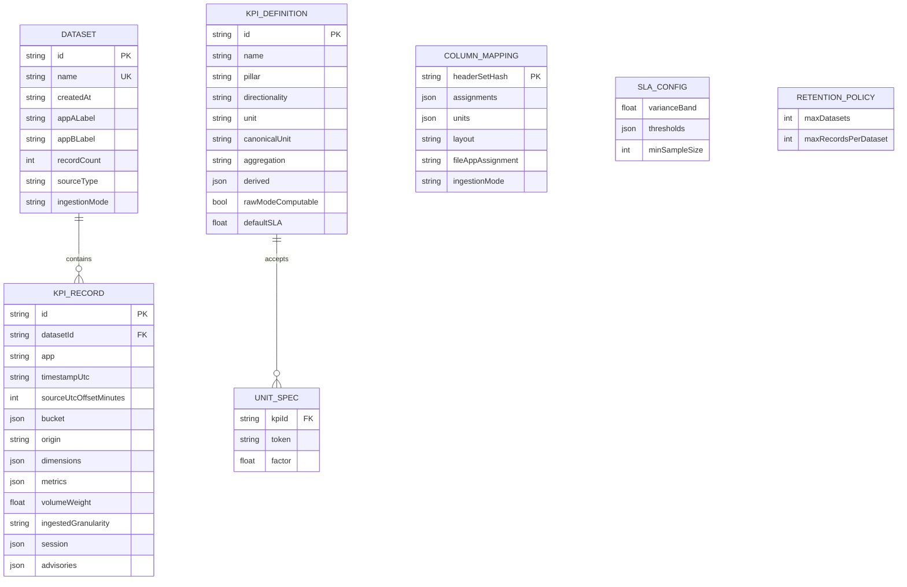

# Design Document: OTT KPI Benchmarking Engine

## Overview

The OTT KPI Benchmarking Engine is a client-first, single-page web application that ingests, persists, aggregates, compares, and visualizes OTT streaming performance KPIs between two applications (App_A and App_B) across four pillars and five slicing dimensions. It supports two ingestion modes (pre-aggregated summaries and raw session logs), performs statistically valid aggregation (volume-weighted averages, linear-interpolated percentiles, rebuffer ratio, VSF rate), and renders a high-density dark broadcast-style dashboard (scorecards, winner heatmap, time-series overlay, percentile distribution, SLA configuration).

The system is architected around a strict separation between **data ingestion**, **persistence (behind a `KPIDataRepository` interface)**, a **pure aggregation engine**, a **global state store**, and **presentation modules**. This separation lets the heavy aggregation math run in a Web Worker, keeps the persistence layer swappable for a future server backend, and makes the numeric core independently testable via property-based tests.

Three cross-cutting concerns shape the design as much as the layering does:

- **Statistical honesty.** Not every KPI can be recombined. Unique-user counts and percentiles ingested as pre-aggregated values cannot be summed or averaged across dimension segments without producing a wrong number, so the engine carries an explicit *aggregability* concept and a `NOT_AGGREGABLE` sentinel distinct from `NO_DATA`. Derived ratios (Stickiness) are computed from aggregated operands, never as a mean of per-segment ratios. Comparisons backed by too few records resolve to a `LowConfidence` status rather than declaring a winner.
- **Canonical representation.** Source files arrive with arbitrary units (`vst_ms` vs `vst_sec`, `kbps` vs `Mbps`), arbitrary layouts (one app column vs one column per app vs one file per app), and arbitrary timezones. Ingestion normalizes all three — units to each KPI's canonical unit, layout to a single canonical `KPIRecord` shape, timestamps to UTC — so that every stored value, threshold comparison, and time bucket is like-for-like.
- **Client residency and accessibility.** All data, including raw session logs that may carry user identifiers, stays in the browser; there is no egress of any kind in this release. The dark high-density UI meets WCAG 2.1 AA, and RAG state is never conveyed by color alone.

### Technology Stack

| Concern | Choice | Rationale / Requirement |
|---|---|---|
| Framework | React 18 + TypeScript, Vite SPA | Client-first, offline-capable (Req 3.4); Vite chosen over Next.js because no server rendering is required and the app is fully browser-resident. |
| Styling / UI | Tailwind CSS + Shadcn UI + Lucide icons | High-density dark theme (Req 15.1, 15.2). |
| Charts | Apache ECharts | High-density time-series, dual Y-axis, radar and box/bar percentile views (Req 13). ECharts chosen over Recharts for dual-axis and large-series performance. |
| Tables | TanStack Table + TanStack Virtual | Headless virtualization for 10k+ rows (Req 15.3, 17.1). |
| File parsing | Papaparse (CSV), SheetJS `xlsx` (XLSX), native `JSON.parse` | Multi-format upload (Req 6.1). |
| Persistence | Dexie.js over IndexedDB, behind `KPIDataRepository` | Large session logs, offline (Req 3.2, 3.4); adapter pattern (Req 3.1). |
| State | Zustand | Global filters, active dataset, active comparison run, SLA config (Req 10, 14, 19). |
| Concurrency | Dedicated Web Worker (Comlink RPC) | Raw aggregation > 25,000 records off the main thread (Req 17.4). |

## Architecture

The application is organized as five layers. Data flows downward from ingestion to persistence, is pulled by the aggregation engine, cached in the state store, and rendered by dashboard modules. User filter changes flow back into the state store, which triggers re-aggregation.



### Layer responsibilities

- **Ingestion Layer** — parses files, prompts for ingestion mode and (where needed) file-level app assignment, detects long vs wide layout, performs fuzzy column mapping and unit inference, converts every value to its KPI's canonical unit, normalizes timestamps to UTC, and emits canonical `KPIRecord`s. Writes only through the repository interface.
- **Persistence Layer** — the `KPIDataRepository` interface plus its `DexieKPIRepository` IndexedDB implementation, fronted by a quota and retention guard. The only layer that touches storage APIs (Req 3.1).
- **Aggregation Engine** — pure functions that bucket records in UTC, group them, compute KPIs, percentiles, weighted averages, distinct counts, derived ratios, deltas, and RAG. It also enforces aggregability (refusing to recombine unique counts and pre-aggregated percentiles) and the minimum-sample-size confidence gate. No DOM, no storage, no React. Large raw jobs are proxied to a Web Worker (Req 17.4).
- **State Layer** — Zustand stores holding active dataset, global filter slice, SLA configuration, and a memoized comparison-result cache.
- **Presentation Layer** — React modules that subscribe to the state layer and render. They never compute KPIs themselves; they read from the comparison-result cache.

### Recompute pipeline

A filter change triggers a debounced (150 ms) recompute. The store selects the active dataset's records, applies the slice filter, and hands the filtered set to the aggregation engine. For pre-aggregated data and raw data under 25,000 records the computation runs synchronously; for raw data over 25,000 records it is dispatched to the Web Worker (Req 17.2, 17.4). Results populate the comparison cache and all modules re-render. The full cycle targets under 1 second for up to 10,000 aggregated rows (Req 17.1).

## Components and Interfaces

### Ingestion components

- **FileParser** — routes by extension to Papaparse / SheetJS / JSON, returns `ParsedFile { headers, rows, sampleValues }`. On failure throws `ParseError` carrying the file name and reason (Req 6.3).
- **IngestionModePrompt** — modal presented after parse and before mapping confirmation, forcing selection of `Pre_Aggregated` or `Raw_Session` (Req 6.5). When the parsed header set contains neither an app column nor app-qualified KPI columns, the same modal additionally requires a **file-level app assignment** (App_A or App_B) that is stamped onto every record from that file (Req 21.5).
- **LayoutDetector** — inspects the fuzzy-match result set to classify the file as `long` or `wide` (see *Layout detection* below) and hands its verdict to the mapping modal as a user-overridable default (Req 21.1–21.3).
- **ColumnMapper** — computes fuzzy match candidates, infers each column's source unit, and renders the mapping modal (Req 7, 22.3, 22.4). Depends on `FuzzyMatcher`, `LayoutDetector`, the `AliasTable`, and the `UnitTable`.
- **FuzzyMatcher** — normalized 0.00–1.00 similarity (Dice coefficient on lowercased, punctuation-stripped bigrams), returns the best candidate ≥ 0.80 or none (Req 7.2, 7.3). Before scoring, recognized app-suffix and unit-suffix tokens are stripped from the header so that `vst_app_a_ms` and `vst_app_b_ms` both match Video Start Time.
- **UnitNormalizer** — converts each mapped numeric value to its KPI's `canonicalUnit` by multiplying by the `UnitSpec` factor for the column's resolved unit, before any record is persisted (Req 22.5). Applies to file ingestion, manual entry, and the mock seeder alike.
- **TimestampNormalizer** — parses the mapped timestamp, converts it to UTC, preserves the original UTC offset on the record, and assigns the record its UTC hour and UTC day bucket (Req 26.1, 26.5).
- **MappingCache** — persists confirmed mappings keyed by a hash of the sorted source-header set; pre-populates on header-set match (Req 7.6, 7.7). The cached mapping includes layout, per-column units, and any file-level app assignment.
- **ManualEntryForm** — dual-entry table with per-field numeric validation (Req 8), plus edit and delete of previously submitted rows (Req 27.8; see *Manual entry* below).
- **MockDataSeeder** — generates a 30-day comparative dataset across platforms and stream types for every KPI (Req 9), emitting values already in canonical units and UTC.

### Repository interface

```typescript
interface KPIDataRepository {
  // Datasets
  listDatasets(): Promise<DatasetMeta[]>;
  getDataset(id: string): Promise<Dataset | undefined>;
  saveDataset(dataset: Dataset): Promise<void>;
  renameDataset(id: string, name: string): Promise<void>;      // rejects duplicate name (Req 19.7)
  deleteDataset(id: string): Promise<void>;                     // Req 3.6, 19.8
  getActiveDatasetId(): Promise<string | undefined>;
  setActiveDatasetId(id: string): Promise<void>;

  // Records (chunked for large session logs)
  appendRecords(datasetId: string, records: KPIRecord[]): Promise<void>;
  getRecords(datasetId: string): Promise<KPIRecord[]>;
  updateRecord(datasetId: string, record: KPIRecord): Promise<void>;   // manual-entry edit (Req 27.8)
  deleteRecord(datasetId: string, recordId: string): Promise<void>;    // manual-entry delete (Req 27.8)

  // Storage capacity and retention
  estimateQuota(): Promise<QuotaEstimate>;                      // Req 27.1
  requestPersistentStorage(): Promise<boolean>;                 // Req 27.3
  getRetentionPolicy(): Promise<RetentionPolicy>;               // Req 27.6
  saveRetentionPolicy(policy: RetentionPolicy): Promise<void>;

  // Configuration
  getSLAConfig(): Promise<SLAConfig>;
  saveSLAConfig(config: SLAConfig): Promise<void>;              // Req 14.2
  getColumnMapping(headerSetHash: string): Promise<ColumnMapping | undefined>;
  saveColumnMapping(mapping: ColumnMapping): Promise<void>;     // Req 7.6
}

interface QuotaEstimate {
  usageBytes: number;
  quotaBytes: number;
  persisted: boolean;           // StorageManager.persisted() result
}

interface RetentionPolicy {
  maxDatasets: number;          // default 10
  maxRecordsPerDataset: number; // default 500_000
}
```

`DexieKPIRepository` implements this over IndexedDB tables `datasets`, `records`, `slaConfig`, `mappings`, `retention`, `appState`. Records are stored in a `records` table indexed by `datasetId` and read in chunks to support large logs (Req 3.2). Every write is wrapped so a failure surfaces a notification while the in-memory dataset is preserved (Req 3.5). Because all consumers depend only on `KPIDataRepository`, a future `SupabaseKPIRepository` / `RestKPIRepository` can be substituted with no change to callers (Req 3.1) — see *Security and Privacy* for the privacy implications of that substitution.

#### Storage quota, failure, and retention

Large raw session logs can exhaust the browser's storage allotment, so capacity is treated as a first-class failure mode rather than an unhandled exception.

- **Before a large write** (any `appendRecords` batch estimated above 10 MB of serialized payload), the repository calls `navigator.storage.estimate()` via `estimateQuota()`. If the projected payload would exceed the remaining `quotaBytes`, the write is refused up front with a message naming the dataset and the shortfall, and nothing is written (Req 27.1, 27.2).
- **Persistence request.** On first successful dataset save the repository calls `navigator.storage.persist()` once via `requestPersistentStorage()` to opt out of best-effort eviction where the browser supports it (Req 27.3). A `false` result is recorded and surfaced as an advisory that stored datasets may be evicted under storage pressure; it never blocks ingestion (Req 27.4).
- **On `QuotaExceededError`** during a write, the entire chunked append is rolled back inside a single Dexie transaction so the dataset is never left half-written. Already-persisted datasets and the in-memory active dataset are both preserved (Req 27.5, 3.5), and the notification names the dataset that failed and suggests deleting older datasets to reclaim space.
- **Retention policy.** `RetentionPolicy` caps the number of stored datasets and the record count per dataset (Req 27.6). When either ceiling is reached, the repository does **not** prune silently: it returns a `RetentionLimitReached` outcome and the Dataset Switcher presents the candidate oldest datasets (by `createdAt`) for the user to delete explicitly. Pruning is always a user-confirmed action (Req 27.7).
- Browsers that do not implement `StorageManager` fall back to attempting the write and handling `QuotaExceededError` reactively; the pre-flight check degrades to a no-op.

### Aggregation engine interface

```typescript
interface AggregationEngine {
  aggregate(records: KPIRecord[], mode: IngestionMode, kpis: KPIDefinition[]): AggregatedResultSet;
  compare(agg: AggregatedResultSet, sla: SLAConfig, kpis: KPIDefinition[]): ComparisonResultSet;
}
```

The engine is a set of pure functions (`bucketTimestamp`, `groupRecords`, `weightedAverage`, `percentile`, `distinctCount`, `rebufferRatio`, `vsfRate`, `resolveAggregability`, `resolveDerived`, `computeDelta`, `classifyRAG`). A `WorkerAggregationEngine` implements the same interface but marshals calls to the worker via Comlink; the store selects it when `mode === Raw_Session && records.length > 25000` (Req 17.4).

Execution order inside `aggregate` is fixed, because several of the guarantees below depend on it:

1. `bucketTimestamp` assigns each record its UTC hour/day bucket.
2. `groupRecords` partitions by `(app, bucket, dimension tags)`.
3. Per-group KPI computation runs for every non-derived KPI, using the KPI's `aggregation` kind.
4. `resolveAggregability` collapses groups up to the active slice; unique counts and pre-aggregated percentiles that would have to be merged across segments resolve to `NOT_AGGREGABLE`.
5. `resolveDerived` computes derived KPIs from the already-aggregated operands for the active slice.
6. `compare` then computes deltas, applies the minimum-sample-size confidence gate, and classifies RAG.

### State stores (Zustand)

- **useDatasetStore** — active dataset, dataset list, custom App_A/App_B labels (Req 19).
- **useFilterStore** — date range, dimension chip selections, app toggle (Req 10).
- **useSLAStore** — per-KPI SLA thresholds and variance band (Req 14).
- **useResultStore** — memoized `ComparisonResultSet`, no-data flags, progress state.

### Presentation modules

- **GlobalFilterBar** (Req 10) — sticky top bar with date-range control, multi-select dimension chips, App_A/App_B toggle, and the Export menu (Req 18.1).
- **ScorecardGrid** (Req 11) — pillar-tabbed grid of scorecards, each showing App_A/App_B value, absolute + percentage delta, RAG badge, 7-day sparkline, partial-data and no-data indicators.
- **WinnerHeatmap** (Req 12) — KPI × dimension-segment matrix, color-coded by winner, with a segment-dimension selector.
- **TimeSeriesOverlay** (Req 13.1–13.5) — dual-Y-axis line chart with a metric switcher.
- **PercentileDistribution** (Req 13.6) — side-by-side P50/P90/P95 bars for VST, Manifest Fetch Latency, TTFB.
- **SLAConfigPanel** (Req 14) — threshold + variance-band editor with range validation.
- **DatasetSwitcher** (Req 19) — active-dataset selector with rename / create / delete and label overrides.
- **ExportMenu / ExecutiveReport** (Req 18) — Delta CSV, Aggregated Summary CSV, print-optimized report.

## Data Models

### Core records and datasets

```typescript
type IngestionMode = "Pre_Aggregated" | "Raw_Session";
type AppAssignment = "App_A" | "App_B";
type SourceType = "Raw" | "Aggregated" | "Mock";

// Two distinct sentinels. NO_DATA means "no contributing records exist".
// NOT_AGGREGABLE means "records exist, but combining them for this slice would be
// statistically invalid" (unique counts or pre-aggregated percentiles across segments).
const NO_DATA = null;                                  // Req 5.5, 5.8, 16.1
const NOT_AGGREGABLE = "NOT_AGGREGABLE" as const;      // Req 23.4, 23.8
type Sentinel = typeof NO_DATA | typeof NOT_AGGREGABLE;
type Numeric = number | Sentinel;

interface KPIRecord {
  id: string;
  datasetId: string;
  app: AppAssignment;           // from an app column, an app-qualified column, or the file-level assignment
  timestampUtc: string;         // ISO 8601, always normalized to UTC with a Z suffix (Req 26.1)
  sourceUtcOffsetMinutes: number | null;   // original offset preserved; null when the source carried none (Req 26.1, 26.2)
  bucket: TimeBucket;           // assigned at ingestion from timestampUtc (Req 26.5)
  origin: "file" | "manual" | "mock";      // manual rows are editable and deletable (Req 27.8, 27.9)
  dimensions: Record<DimensionId, string>; // missing dim -> filled with "Unknown" at slice time (Req 16.2)
  // Pre-aggregated payload (every value already expressed in its KPI's canonicalUnit):
  metrics?: Partial<Record<CanonicalKPIId, number>>;
  volumeWeight?: number;        // session count / watch time (Req 20)
  ingestedGranularity?: "hour" | "day";    // granularity at which non-aggregable KPIs remain valid (Req 23.5)
  // Raw-session payload:
  session?: RawSessionFields;
  advisories?: DataQualityAdvisory[];      // assumed unit, non-monotonic quartiles, ... (Req 22.6, 22.9)
}

interface TimeBucket {
  hourUtc: string;              // "2025-03-14T09:00:00Z"
  dayUtc: string;               // "2025-03-14"
}

interface DataQualityAdvisory {
  code:
    | "ASSUMED_UNIT"                // unit could not be inferred; canonical unit assumed (Req 22.6)
    | "NON_MONOTONIC_QUARTILES"     // completion quartiles violate 25% >= 50% >= 75% >= 100% (Req 22.9)
    | "UNWEIGHTED_AGGREGATE"        // Req 20.4
    | "UNKNOWN_DIMENSION_MEMBER";   // Req 2.7
  detail: string;
}

interface RawSessionFields {
  // Playback quality
  bufferingMs?: number;
  playTimeMs?: number;          // time spent playing content
  viewingTimeMs?: number;       // total viewing time, denominator for per-hour rates
  rebufferEventCount?: number;  // discrete rebuffer events, for Rebuffer Rate
  startFailure?: 0 | 1;
  playbackAttempt?: 0 | 1;
  exitBeforeStart?: 0 | 1;      // EBVS numerator
  vstMs?: number;
  ttfbMs?: number;
  manifestFetchMs?: number;
  renderedBitrateKbps?: number; // session average rendered bitrate
  downshiftCount?: number;      // bitrate downshifts in the session
  // Engagement
  userId?: string;              // identifier for distinct-count KPIs (Req 23.1, 28.12; see Security and Privacy)
  sessionDurationMs?: number;
  quartileReached?: 0 | 25 | 50 | 75 | 100;  // furthest completion quartile reached
  browseEvent?: 0 | 1;          // Browse-to-Play denominator
  playEvent?: 0 | 1;            // Browse-to-Play numerator
  // Ad events
  adRequestCount?: number;
  adFilledCount?: number;
  adStartFailureCount?: number;
  adCompleteCount?: number;
  adPodStartCount?: number;
  adPodAbandonCount?: number;
  cacheHit?: 0 | 1;             // CDN edge cache outcome for the manifest/segment request
  [field: string]: number | string | undefined;
}

interface DatasetMeta {
  id: string;
  name: string;                 // unique (Req 19.7)
  createdAt: string;            // Req 19.1
  appALabel: string;            // custom label (Req 19.5)
  appBLabel: string;
  recordCount: number;
  sourceType: SourceType;       // Req 19.1
  ingestionMode: IngestionMode;
}

interface Dataset extends DatasetMeta {
  records: KPIRecord[];
}
```

### KPI taxonomy registry (Req 1)

```typescript
type Pillar =
  | "Playback Quality & QoE"
  | "User Engagement & Audience Retention"
  | "Monetization & AdTech"
  | "Infrastructure & Delivery";

type Directionality = "higher_is_better" | "lower_is_better";

type AggregationKind =
  | "weighted_avg"      // rates and percentages, weighted by volumeWeight (Req 20)
  | "percentile"        // valid only over an underlying distribution
  | "sum"              // additive totals (watch time, event counts)
  | "ratio"            // numerator/denominator recomputed from summed components
  | "arithmetic_avg"   // unweighted mean, used only where no weight is meaningful
  | "distinct_count"   // DAU / WAU / MAU: countable from raw sessions, never summable
  | "non_aggregable";  // cannot be validly combined across segments at all

interface UnitSpec {                // Req 22.1
  token: string;        // unit token as it appears in headers, e.g. "ms", "s", "kbps"
  factor: number;       // multiply a value in this unit by factor to get the canonical unit
}

interface KPIDerivation {
  operands: CanonicalKPIId[];   // must themselves be aggregated first (Req 24.2)
  operation: "divide" | "multiply" | "subtract";
  scale?: number;               // e.g. 100 to express a ratio as a percentage
}

interface KPIDefinition {
  id: CanonicalKPIId;
  name: string;
  pillar: Pillar;
  directionality: Directionality;
  unit: string;                 // display unit; equals canonicalUnit
  canonicalUnit: string;        // the single unit all stored values are expressed in (Req 22.1, 22.2)
  acceptedUnits: UnitSpec[];    // source units recognized at ingestion, with conversion factors (Req 22.1)
  defaultSLA?: number;          // Req 1.2, expressed in canonicalUnit (Req 22.2)
  validRange?: [number, number];// used by SLA panel validation (Req 14.4), in canonicalUnit (Req 22.2)
  aggregation: AggregationKind;
  derived?: KPIDerivation;      // present only for derived KPIs (e.g. Stickiness — Req 24.1)
  aliases: string[];            // fuzzy-match aliases, e.g. ["ttff","startup_time","vst_ms"] (Req 7.4)
  percentileRanks?: number[];   // e.g. [50, 90, 95] for latency KPIs
  rawModeComputable: boolean;   // false -> pre-aggregated-only (see the raw-mode coverage matrix)
}
```

The registry is a static array seeded from Requirement 1 (VST P50/P95 @ 1.5s, Rebuffer Ratio @ 0.4%, Rebuffer Rate @ 0.2/hr, VSF @ 0.5%, EBVS @ 1.8%, Avg Rendered Bitrate, Downshift Frequency; Total Watch Time, Avg Session Duration, DAU/WAU/MAU, Stickiness, Content Completion Rate quartiles, Browse-to-Play; Ad Fill Rate, Ad Start Failure @ 0.8%, VCR Ads, Ad Pod Drop-off, Churn Rate, ARPU; CDN Cache Hit Ratio @ 95%, Manifest Fetch Latency, TTFB).

#### Units and canonical representation

Every KPI declares one `canonicalUnit` and the set of source units it accepts (Req 22.1). All persisted values, all SLA thresholds, and all valid ranges are expressed in the canonical unit, so threshold comparisons and deltas are always like-for-like (Req 22.2).

| KPI group | `canonicalUnit` | `acceptedUnits` (token → factor) |
|---|---|---|
| Video Start Time (P50/P95) | `s` | `ms` → 0.001, `s` → 1 |
| Manifest Fetch Latency, TTFB | `ms` | `s` → 1000, `ms` → 1 |
| Average Rendered Bitrate | `Mbps` | `bps` → 1e-9, `kbps` → 0.001, `Mbps` → 1 |
| Total Watch Time | `hours` | `s` → 1/3600, `ms` → 1/3600000, `min` → 1/60, `hours` → 1 |
| Average Session Duration | `min` | `s` → 1/60, `ms` → 1/60000, `min` → 1 |
| All percentage / rate KPIs | `%` | `%` → 1, `ratio` → 100 |
| Rebuffer Rate | `events/hour` | `events/hour` → 1, `events/min` → 60 |
| ARPU | `USD` | `USD` → 1 (currency conversion is out of scope) |
| DAU / WAU / MAU, Downshift Frequency | `count`, `drops/session` | identity only |

#### Unit inference and normalization

Unit resolution happens during column mapping, before persistence:

1. **Inference from the header token** (Req 22.3). The normalized header is scanned for a recognized unit suffix or embedded token: `vst_ms` → `ms`; `vst_sec`, `vst_s`, `startup_time_seconds` → `s`; `bitrate_kbps` → `kbps`; `ttfb_millis` → `ms`; `watch_time_hours` → `hours`. Token matching is restricted to the KPI's own `acceptedUnits`, so `_s` on a bitrate column is not mistaken for seconds.
2. **User confirmation** (Req 22.4). The Column_Mapping modal renders a per-column unit selector listing that KPI's `acceptedUnits`, with the inferred unit preselected. The user can override it; the choice is stored on the mapping and reused via the mapping cache.
3. **Fallback** (Req 22.6). If no unit can be inferred, the selector defaults to the canonical unit and the column is marked with an `ASSUMED_UNIT` advisory asking the user to confirm the assumed unit. Ingestion is not blocked.
4. **Normalization** (Req 22.5). `UnitNormalizer` multiplies each ingested value by the resolved `UnitSpec.factor`, so every value written through the repository is already canonical. Raw-session fields carry their unit in the field name (`bufferingMs`, `renderedBitrateKbps`) and are converted by the same table when the derived KPI's canonical unit differs.

Normalization is deliberately a single multiplicative step: that makes it exactly invertible (up to floating-point tolerance), makes it a no-op on values already in the canonical unit, and keeps it usable inside the pure aggregation core without any lookup at compute time.

#### Aggregation kinds by KPI

- `weighted_avg` — Rebuffer Ratio, VSF, EBVS, Ad Fill Rate, Ad Start Failure, VCR Ads, Ad Pod Drop-off, Churn Rate, CDN Cache Hit Ratio, Browse-to-Play, Content Completion Rate quartiles, Average Rendered Bitrate, Average Session Duration, ARPU.
- `sum` — Total Watch Time.
- `ratio` — Rebuffer Rate and Downshift Frequency, recomputed from summed numerator and denominator rather than averaged.
- `percentile` — Video Start Time P50/P95, Manifest Fetch Latency, TTFB. Valid only over an underlying distribution (Req 23.6); see *Percentile aggregability*.
- `distinct_count` — Daily, Weekly, and Monthly Active Users. These are counts of distinct users and are never summed or weight-averaged (Req 23.3).
- `derived` (via the `derived` field) — Stickiness, computed as aggregated DAU ÷ aggregated MAU (Req 24.1).

### Dimension model (Req 2)

```typescript
type DimensionId = "platform" | "network" | "cdn" | "geography" | "streamType";

interface DimensionDefinition {
  id: DimensionId;
  name: string;
  members: string[];            // seed members; extensible at ingest (Req 2.7)
  extensible: true;             // unknown ingested values are appended as new members
}

const UNKNOWN_MEMBER = "Unknown";  // Req 16.2
```

Seed members follow Req 2: Platform (Tizen, WebOS, Android TV, Apple TV, FireTV, iOS, Android, Desktop Web); Network (Wi-Fi, Cellular 5G, Cellular 4G, Broadband, + named ISPs); CDN (Akamai, Cloudflare, Fastly, AWS CloudFront); Geography (Country / Region / Metro levels); Stream Type (Live Sports/Events, VOD Movies, VOD Series, FAST linear).

### Mapping, SLA, and aggregated results

```typescript
type SourceLayout = "long" | "wide";

interface ColumnMapping {
  headerSetHash: string;                        // key for reuse (Req 7.6, 7.7)
  headers: string[];
  assignments: Record<string, MappingTarget>;   // sourceHeader -> target
  units: Record<string, string>;                // sourceHeader -> resolved source unit token (Req 22.4)
  layout: SourceLayout;                         // detected, user-confirmable (Req 21.3)
  fileAppAssignment?: AppAssignment;            // set when the file carries no app column and no app-qualified columns (Req 21.5)
  ingestionMode: IngestionMode;
}

type MappingTarget =
  // `app` is present only in wide layout, where each column belongs to one app
  | { kind: "kpi"; kpiId: CanonicalKPIId; app?: AppAssignment }
  | { kind: "dimension"; dimensionId: DimensionId }
  | { kind: "app" } | { kind: "timestamp" } | { kind: "volumeWeight" }
  | { kind: "userId" }                          // enables distinct-count KPIs in raw mode (Req 23.1, 23.2)
  | { kind: "unmapped" };

interface SLAConfig {
  varianceBand: number;                         // default 1.5 (%) (Req 11.6, 14.1)
  thresholds: Partial<Record<CanonicalKPIId, number>>;  // overrides of defaultSLA (Req 14.2)
  minSampleSize: number;                        // default 100 contributing records per app (Req 25.1)
}

type Aggregability = "aggregable" | "not_aggregable";

interface AggregatedKPIValue {
  kpiId: CanonicalKPIId;
  app: AppAssignment;
  value: Numeric;               // NO_DATA when absent, NOT_AGGREGABLE when invalid to combine
  unit: string;                 // always the KPI's canonicalUnit
  aggregability: Aggregability; // "not_aggregable" when the slice would require an invalid merge (Req 23.4)
  weighted: boolean;            // false triggers unweighted advisory (Req 20.4)
  contributingRecords: number;  // drives the minimum-sample-size confidence gate (Req 25.2, 25.3)
  ingestedGranularity?: "hour" | "day";         // granularity this value is valid at, when not aggregable (Req 23.5)
  rejectedRecords: RejectedRecord[];            // Req 5.7, 4.3
  advisories: DataQualityAdvisory[];
  series?: { date: string; value: Numeric }[];  // for sparkline / time-series
}

interface RejectedRecord { recordId: string; field?: string; reason: string; }

interface AggregatedResultSet {
  bySegment: Map<string /* segmentKey */, AggregatedKPIValue[]>;
  overall: AggregatedKPIValue[];
  unweightedAdvisory: boolean;
}

type RAGStatus = "Red" | "Amber" | "Green" | "LowConfidence" | "NoData";

// Reason a comparison was suppressed, so the UI can explain itself precisely.
type SuppressionReason =
  | "no_data"                   // one or both aggregates are NO_DATA
  | "not_aggregable"            // one or both aggregates are NOT_AGGREGABLE (Req 23.8)
  | "below_min_sample";         // contributing volume under SLAConfig.minSampleSize (Req 25.4)

interface ComparisonResult {
  kpiId: CanonicalKPIId;
  appAValue: Numeric;
  appBValue: Numeric;
  absoluteDelta: Numeric;       // appB - appA (Req 11.3)
  percentDelta: Numeric | "N/A";// NO_DATA/"N/A" when appA == 0 (Req 11.4)
  rag: RAGStatus;
  suppressionReason?: SuppressionReason;
  appAContributingRecords: number;
  appBContributingRecords: number;
}

interface ComparisonResultSet {
  results: ComparisonResult[];
  slice: FilterSlice;
}
```

### Filter slice

```typescript
interface FilterSlice {
  // from/to are inclusive on both ends, evaluated against the normalized UTC bucket (Req 26.7)
  dateRange: { preset: "7d" | "30d" | "custom"; from?: string; to?: string };
  granularity: "hour" | "day";  // bucket granularity for series and rollup (Req 26.6)
  displayTimezone: string;      // IANA zone for rendering only; "UTC" by default (Req 26.8, 26.9)
  dimensionSelections: Partial<Record<DimensionId, string[]>>;  // multi-select chips (Req 10.3)
  apps: AppAssignment[];        // App_A / App_B toggle (Req 10.4)
}
```

### Sentinel and status propagation

`NO_DATA` and `NOT_AGGREGABLE` both suppress the comparison, but they mean different things and are reported differently. `LowConfidence` suppresses only the verdict, not the numbers.

| Aggregate state | Displayed value | Delta | RAG | User-facing reason |
|---|---|---|---|---|
| `NO_DATA` (no contributing records) | no-data indicator (em-dash) | not computed | `NoData` | "No records in this slice" (Req 11.9, 16.5) |
| `NOT_AGGREGABLE` (records exist, merge invalid) | not-aggregable indicator | not computed | `NoData` with `suppressionReason: "not_aggregable"` | "This metric cannot be combined across the selected segments — narrow the slice to the granularity it was ingested at" (Req 23.8) |
| Below `minSampleSize` | value **and** delta both shown | computed | `LowConfidence` | "Only *n* records for App_A / *m* for App_B — below the *minSampleSize* threshold" (Req 25.5, 25.7) |
| Derived KPI with a suppressed operand | inherits the operand's indicator | not computed | inherits the operand's status | names the operand that was unavailable (Req 24.4) |

The distinction matters in practice: `NO_DATA` tells the analyst to widen the slice, while `NOT_AGGREGABLE` tells them to narrow it. Collapsing both into one indicator would send the wrong instruction. Both render as a `NoData` RAG so that Requirements 16.5 and 23.8 (exclude from delta and RAG) hold uniformly, and both carry a tooltip built from `suppressionReason`.

## Aggregation Engine Specification

All formulas below are pure and deterministic. Records are first grouped by `(app, timePeriod, dimension tags)` before any KPI is computed (Req 5.6). Missing slice dimensions map the record to `"Unknown"` (Req 16.2). Every value entering these formulas is already in its KPI's canonical unit, so no conversion happens at compute time.

### Timezone policy and time bucketing

Mixed-offset source data is the norm in OTT telemetry (CDN logs in UTC, player logs in local time), so the design fixes a single storage timezone and treats display timezone as a purely presentational concern.

**Normalization on ingestion.** `TimestampNormalizer` parses the mapped timestamp and converts it to UTC:

- An explicit offset or `Z` suffix is honored, and the original offset is preserved in `sourceUtcOffsetMinutes` so the source value can always be reconstructed for audit (Req 26.1).
- A naive timestamp (no offset) is interpreted as UTC, `sourceUtcOffsetMinutes` is set to `null`, and the column is flagged in the mapping modal so the user can see the assumption being made (Req 26.2).
- A date-only value (`2025-03-14`) is anchored at `00:00:00Z` (Req 26.3).
- An unparseable timestamp rejects the record with a reason, exactly like any other invalid required field (Req 26.4, 5.7).

**Bucketing** (Req 26.5). `bucketTimestamp` is a total function: every record with a valid `timestampUtc` is assigned exactly one `hourUtc` and exactly one `dayUtc`, with `dayUtc` being the UTC calendar day containing `hourUtc`. There is no record that falls into two buckets and none that falls into zero. Because bucketing is done in UTC there are no DST gaps or repeated hours to resolve.

**Hourly-to-daily rollup** (Req 26.6). When the active slice requests `granularity: "day"` over hourly records, the 24 hourly buckets of a UTC day roll into that day using the KPI's own `aggregation` kind — never a plain mean:

| KPI aggregation | Hourly → daily rollup |
|---|---|
| `sum` | sum of the hourly values |
| `weighted_avg` | weighted average of hourly values using each hour's `volumeWeight` |
| `ratio` | numerator and denominator summed across hours, then divided |
| `percentile` (raw mode) | recomputed from the union of the day's raw values |
| `percentile` (pre-aggregated) | `NOT_AGGREGABLE` — hourly percentiles cannot be merged |
| `distinct_count` (raw mode, `userId` mapped) | distinct users across the day's sessions |
| `distinct_count` (pre-aggregated) | `NOT_AGGREGABLE` — hourly unique counts double-count returning users |
| `derived` | recomputed from the rolled-up operands |

**Date-range boundaries** (Req 26.7). A custom range is **inclusive of both start and end**, evaluated on the normalized bucket: a record is in range when `from <= record.bucket.dayUtc <= to` at day granularity, or `from <= record.bucket.hourUtc <= to` at hour granularity. The `7d` and `30d` presets are the last 7 or 30 complete UTC days plus the current partial day, resolved to explicit `from`/`to` values before filtering so the slice is reproducible.

**Display** (Req 26.8, 26.9). The dashboard renders and buckets in UTC by default. `FilterSlice.displayTimezone` lets the user pick an IANA zone for axis labels, tooltips, and exported timestamps; it changes rendering only. Bucket boundaries stay UTC so that the same slice always produces the same numbers regardless of who is looking at it, and the active display zone is labelled on the filter bar and in exports to avoid ambiguity.

### Ingestion mode assessment for testing

The numeric core (percentiles, weighted averages, distinct counts, rebuffer ratio, VSF rate, derived ratios, bucketing, delta, RAG) consists of pure functions over large input spaces with universal mathematical properties — an ideal fit for property-based testing. The UI modules (charts, tables, panels), persistence wiring, and file parsing are better served by example, snapshot, and integration tests. The Correctness Properties section therefore targets the numeric core.

### Raw-mode KPI coverage matrix

Not every KPI in the taxonomy can be derived from a playback session log. Being explicit about this prevents the engine from silently inventing a number and prevents the UI from showing a blank where an explanation belongs. Each KPI's `rawModeComputable` flag is driven by this table. "Conditional" means computable only when the listed optional session fields are actually mapped; when they are not, the KPI behaves exactly like a pre-aggregated-only KPI in that dataset.

Sums below are over the valid records of a group; `sessions` is the count of valid session records in the group.

#### Playback Quality & QoE

| KPI | Raw-mode | Required mapped session fields | Formula / aggregation kind |
|---|---|---|---|
| Video Start Time P50 / P95 | Yes | `vstMs` | `percentile` — linear interpolation over the group's VST distribution, converted to seconds |
| Rebuffer Ratio | Yes | `bufferingMs`, `playTimeMs` | `100 * sum(bufferingMs) / (sum(playTimeMs) + sum(bufferingMs))` |
| Rebuffer Rate | Yes | `rebufferEventCount`, `viewingTimeMs` | `ratio` — `sum(rebufferEventCount) / (sum(viewingTimeMs) / 3_600_000)` events per viewing hour |
| Video Start Failures | Yes | `startFailure`, `playbackAttempt` | `100 * sum(startFailure) / sum(playbackAttempt)` |
| Exit Before Video Start | Yes | `exitBeforeStart`, `playbackAttempt` | `100 * sum(exitBeforeStart) / sum(playbackAttempt)` |
| Average Rendered Bitrate | Yes | `renderedBitrateKbps`, `playTimeMs` | `weighted_avg` — watch-time-weighted mean: `sum(bitrate·playTime) / sum(playTime)`, converted to Mbps |
| Downshift Frequency | Yes | `downshiftCount` | `ratio` — `sum(downshiftCount) / sessions` drops per session |

#### User Engagement & Audience Retention

| KPI | Raw-mode | Required mapped session fields | Formula / aggregation kind |
|---|---|---|---|
| Total Watch Time | Yes | `playTimeMs` (or `viewingTimeMs`) | `sum` — `sum(playTimeMs) / 3_600_000` hours |
| Average Session Duration | Yes | `sessionDurationMs` | `weighted_avg` — `sum(sessionDurationMs) / sessions / 60_000` minutes |
| Daily Active Users | Conditional on `userId` | `userId`, `timestampUtc` | `distinct_count` — distinct `userId` within the UTC day bucket |
| Weekly Active Users | Conditional on `userId` | `userId`, `timestampUtc` | `distinct_count` — distinct `userId` over the trailing 7 UTC days |
| Monthly Active Users | Conditional on `userId` | `userId`, `timestampUtc` | `distinct_count` — distinct `userId` over the trailing 30 UTC days |
| Stickiness | Derived | whatever DAU and MAU require | `derived` — `100 * aggregatedDAU / aggregatedMAU` |
| Content Completion Rate (25 / 50 / 75 / 100%) | Yes | `quartileReached`, `playbackAttempt` | `count(quartileReached >= q) / count(sessions started)` per quartile `q` |
| Browse-to-Play Conversion | Conditional on browse events | `browseEvent`, `playEvent` | `100 * sum(playEvent) / sum(browseEvent)` |

#### Monetization & AdTech

| KPI | Raw-mode | Required mapped session fields | Formula / aggregation kind |
|---|---|---|---|
| Ad Fill Rate | Conditional on ad fields | `adRequestCount`, `adFilledCount` | `100 * sum(adFilledCount) / sum(adRequestCount)` |
| Ad Start Failure | Conditional on ad fields | `adStartFailureCount`, `adFilledCount` | `100 * sum(adStartFailureCount) / sum(adFilledCount)` |
| Video Completion Rate for Ads | Conditional on ad fields | `adCompleteCount`, `adFilledCount` | `100 * sum(adCompleteCount) / sum(adFilledCount)` |
| Ad Pod Drop-off Rate | Conditional on ad fields | `adPodAbandonCount`, `adPodStartCount` | `100 * sum(adPodAbandonCount) / sum(adPodStartCount)` |
| Churn Rate | No — pre-aggregated only | — | Requires subscription lifecycle state, which is not present in a playback session log |
| Average Revenue Per User | No — pre-aggregated only | — | Requires billing/revenue data, which is not present in a playback session log |

#### Infrastructure & Delivery

| KPI | Raw-mode | Required mapped session fields | Formula / aggregation kind |
|---|---|---|---|
| CDN Cache Hit Ratio | Conditional on `cacheHit` | `cacheHit` | `100 * sum(cacheHit) / sessions` |
| Manifest Fetch Latency (median) | Yes | `manifestFetchMs` | `percentile` — P50, with P90/P95 also available |
| Time To First Byte | Yes | `ttfbMs` | `percentile` — P50 / P90 / P95 |

#### Behavior for KPIs that are not raw-computable

When a `Raw_Session` dataset is active and a KPI is either `rawModeComputable: false` or conditional on session fields that were not mapped, the engine emits `NO_DATA` for it rather than guessing. The scorecard, heatmap cell, and chart render the no-data indicator with a specific explanation — "not derivable from session logs" or "requires a mapped `userId` column" — so the analyst can tell an unmappable KPI apart from an empty slice. Such KPIs remain fully available in `Pre_Aggregated` datasets, and the mapping modal names the session fields that would unlock each conditional KPI.

### Rebuffer Ratio (Req 5.2)

```
rebufferRatio = 100 * sum(bufferingMs) / (sum(playTimeMs) + sum(bufferingMs))
```
Rounded to 2 decimals. If the denominator is 0 → `NO_DATA` (Req 5.5, 16.1).

### VSF Rate (Req 5.3)

```
vsfRate = 100 * sum(startFailure) / sum(playbackAttempt)
```
Rounded to 2 decimals. If `sum(playbackAttempt) == 0` → `NO_DATA` (Req 5.5).

### Percentiles P50 / P90 / P95 (Req 5.4) — linear interpolation between nearest ranks

Given sorted ascending values `x[0..n-1]` and percentile `p` (0–100):
```
if n == 0            -> NO_DATA                          (Req 5.8)
rank = (p / 100) * (n - 1)      // 0-based fractional rank
lo   = floor(rank); hi = ceil(rank)
frac = rank - lo
value = x[lo] + frac * (x[hi] - x[lo])
```
This yields exact percentiles at ranks and monotonic non-decreasing values as `p` increases.

### Volume-Weighted Average (Req 20.1, 20.2) with arithmetic fallback (Req 20.3, 20.4)

For percentage/rate KPIs aggregated across rows with values `v[i]` and weights `w[i]`:
```
if all weights present and sum(w) > 0:
    weightedAvg = sum(v[i] * w[i]) / sum(w[i])           // weighted = true
else:
    weightedAvg = sum(v[i]) / n                          // weighted = false -> advisory (Req 20.4)
if n == 0 -> NO_DATA
```

### Unique-count KPIs: DAU / WAU / MAU

DAU, WAU, and MAU are counts of *distinct* users. They are not additive and they are not weight-averageable: a user active on both Monday and Tuesday contributes 1 to each day's DAU but 1 — not 2 — to the two-day unique count, and the same user active on both Android and iOS contributes 1 to the overall count but appears in two platform segments. Summing or averaging them across buckets or segments produces a number with no meaning.

**Raw_Session_Mode (with a mapped `userId`)** (Req 23.1). Dedupe is correct by construction because the underlying identities are present:

```
distinctCount(group) = |{ s.userId : s in validSessions(group) }|
```

The count is taken over the set of user identifiers in the group, so duplicate session rows for the same user collapse, and the result is computed independently for each `(app, bucket, dimension tags)` group and independently again for each larger slice directly from the sessions in that slice. It is never assembled from smaller groups' counts (Req 23.3). `sessions == 0` → `NO_DATA`. WAU and MAU use the same function over the trailing 7-day and 30-day UTC windows.

**Raw_Session_Mode (no mapped `userId`)** (Req 23.2). The KPI is not computable; it emits `NO_DATA` with the "requires a mapped `userId` column" explanation.

**Pre_Aggregated_Mode.** The source supplies an already-computed unique count for some granularity — say DAU per platform per day. The underlying identities are gone, so no valid recombination exists. The rule is:

- A unique count is displayed **only at the granularity it was ingested at**, recorded in `ingestedGranularity` and the record's dimension tags (Req 23.5).
- If the active slice matches that granularity exactly (one bucket, one segment per tagged dimension), the ingested value is displayed as-is (Req 23.5).
- If the active slice would require combining unique counts across buckets or across dimension segments, the value resolves to `NOT_AGGREGABLE`, not to a sum and not to an average (Req 23.4).
- Upper and lower bounds could in principle be reported (the true value lies between `max` and `sum` of the segments), but a range is not a KPI and would be compared as if it were a point value, so the design deliberately reports nothing rather than something misleading.

`NOT_AGGREGABLE` propagates into Delta and RAG exactly as described in *Sentinel and status propagation*: the comparison is suppressed with `suppressionReason: "not_aggregable"`, and the tooltip tells the analyst to narrow the slice to the ingested granularity — the opposite of the advice given for `NO_DATA`.

### Percentile aggregability

A percentile is a statement about a distribution. Given the distribution you can compute any percentile; given only the percentile you cannot recover the distribution, and you cannot combine percentiles from two distributions into the percentile of their union. The arithmetic mean of two groups' P95 values is not the P95 of the combined group, and can be arbitrarily far from it.

- **Raw_Session_Mode.** Percentiles are computed per group from the raw values in that group using the linear-interpolation formula above, and recomputed from raw values for every slice and every rollup (Req 23.7). This is always valid, and it is the existing behavior.
- **Pre_Aggregated_Mode.** An ingested percentile column (`vst_p95`, `ttfb_p50`) is treated as `non_aggregable`. It is displayed at its ingested granularity (Req 23.5), and any slice that would require merging percentiles across buckets or segments resolves to `NOT_AGGREGABLE` (Req 23.4). **Averaging percentiles is statistically invalid and the engine does not do it** (Req 23.6) — there is no code path, weighted or unweighted, that produces a mean of percentile values.
- The `weighted_avg` path is never selected for a KPI whose `aggregation` is `percentile`, which is what makes this a structural guarantee rather than a convention.

### Derived KPIs

A derived KPI is computed from other *aggregated* KPIs rather than from records. Stickiness is the only one in the current taxonomy (Req 24.1):

```
Stickiness = 100 * aggregate(DAU, slice) / aggregate(MAU, slice)
```

The ordering constraint is the whole point. `resolveDerived` runs **after** every operand has been aggregated for the active slice, and consumes only those aggregates (Req 24.2). The engine never averages per-group Stickiness values (Req 24.3), because the mean of per-group ratios is not the ratio of the aggregates unless the groups happen to carry equal weight — for unequal groups the two differ, and the mean-of-ratios answer is the wrong one. There is no code path that averages derived values across groups.

Sentinel inheritance: if any operand is `NO_DATA` or `NOT_AGGREGABLE`, the derived KPI takes that same sentinel and reports the operand responsible, so a Stickiness cell reads "MAU cannot be combined across the selected segments" rather than an unexplained blank (Req 24.4). If the denominator operand aggregates to exactly 0, the result is `NO_DATA` per the zero-divisor rule (Req 24.5, 16.1).

### Content completion funnel monotonicity

The completion quartiles form a funnel: a session that reached 75% necessarily reached 50% and 25%. So for any group the computed rates must satisfy:

```
completion(25%) >= completion(50%) >= completion(75%) >= completion(100%)
```

- **Raw mode** satisfies this by construction, because each quartile rate counts sessions with `quartileReached >= q` over the same denominator, and the counted sets are nested.
- **Pre-aggregated mode** can receive violating rows (upstream bugs, mismatched denominators, quartiles computed over different populations). On ingestion each record carrying two or more quartile values is checked. A violation raises a `NON_MONOTONIC_QUARTILES` advisory naming the record and the offending pair (Req 22.9). The record is **retained and still aggregated** (Req 22.8) — discarding data because it looks wrong would silently change the totals, which is worse than flagging it — and the advisory surfaces on the affected scorecards and in the data-quality panel.

### Record rejection (Req 5.7, 4.3)

A raw session is rejected (recorded with reason) if a required mapped field is missing, non-numeric, or negative. A pre-aggregated numeric field that is non-numeric is excluded and reported (Req 4.3). Rejected records never contribute to any sum, count, or percentile input.

### Delta and RAG classification

```
absoluteDelta = appB - appA                              (Req 11.3)
percentDelta  = (appA == 0) ? "N/A" : 100 * (appB - appA) / appA   (Req 11.3, 11.4)
```

RAG (Req 11.5, 11.6, variance band default 1.5%). Two gates run before classification: the sentinel gate, then the confidence gate.

```
// Gate 1 - sentinels (Req 16.5)
if appA or appB is NO_DATA         -> NoData, reason = "no_data"
if appA or appB is NOT_AGGREGABLE  -> NoData, reason = "not_aggregable"

// Gate 2 - minimum sample size (Req 25.4, 25.6)
if appAContributingRecords < sla.minSampleSize
   or appBContributingRecords < sla.minSampleSize
                                   -> LowConfidence, reason = "below_min_sample"
                                      (values and deltas are still computed and displayed - Req 25.5)

// improvement direction depends on directionality:
//   higher_is_better  -> appB > appA is improvement (positive delta good)
//   lower_is_better   -> appB < appA is improvement (negative delta good)

if appA == 0:                                            (Req 11.4)
    sign = sign(absoluteDelta)
    improved = (higher_is_better) ? sign > 0 : sign < 0
    -> Green if improved and sign != 0, Red if degraded, Amber if sign == 0
else:
    if abs(percentDelta) <= varianceBand -> Amber        (Req 11.5)
    else improved = (higher_is_better) ? percentDelta > 0 : percentDelta < 0
    -> Green if improved else Red
```

### Minimum sample size and the LowConfidence status

A 40% "improvement" computed from six sessions on one platform is noise, and a heatmap that paints it green is actively misleading. `SLAConfig.minSampleSize` (default **100** contributing records or sessions per app, editable in the SLA panel — Req 25.1) is the volume floor below which the engine declines to declare a winner.

- The threshold is evaluated **per app, per KPI, per slice** against `contributingRecords` — the count of records that actually fed the aggregate after rejections, not the raw row count (Req 25.2). For pre-aggregated data with a `volumeWeight`, the summed weight is used instead of the row count, since ten rows summarizing a million sessions are not a small sample (Req 25.3).
- If **either** app falls below the floor, the status is `LowConfidence` (Req 25.4). Requiring both to be above it would let a well-sampled app be compared against a thinly sampled one.
- `LowConfidence` suppresses only the verdict (Req 25.6). The App_A value, App_B value, absolute delta, and percentage delta are all still computed and displayed (Req 25.5), with an indicator naming both contributing counts and the active threshold (Req 25.7). The analyst keeps the numbers; they just do not get a green light.
- The gate applies uniformly to **Scorecards and to every Heatmap cell** (Req 25.8). Per-segment heatmap cells are where thin samples appear most often — a long-tail ISP or a small metro market — so cells below the floor render as low-confidence rather than as a winner. The Heatmap's winner determination is skipped entirely for those cells (Req 25.9).
- Setting `minSampleSize` to 0 disables the gate, which is useful for manual-entry datasets where each row is a summary rather than a sample (Req 25.11). The SLA panel validates the entry as a non-negative integer (Req 25.10).

### Winner determination for heatmap (Req 12.2)

Compare `appA` vs `appB` with respect to directionality; the better value wins. If either is `NO_DATA` the cell is no-data (Req 12.5); if either is `NOT_AGGREGABLE` the cell is not-aggregable (Req 23.4); and if either app's contributing volume is below `minSampleSize` the cell is low-confidence and no winner is determined (Req 25.9). Each of those three outcomes carries its own glyph and label so they are distinguishable without relying on fill color (Req 28.2).

### Web Worker offloading (Req 17.2, 17.4)

For `Raw_Session` datasets exceeding 25,000 records, `groupRecords` + all KPI computation run inside a dedicated worker via Comlink. Records are transferred as structured-cloned arrays; progress messages drive the progress indicator (Req 17.3). The main thread stays interactive so the filter bar remains usable (Req 17.2). Under the threshold the same pure functions run synchronously.

## Ingestion Pipeline

The dual-mode ingestion flow parses the file, prompts for ingestion mode and (where required) file-level app assignment, resolves the source layout, applies (or reuses) a fuzzy column mapping with per-column units, validates the mapping, normalizes units and timestamps, and writes canonical records through the repository.



### Source layout: long, wide, and file-level assignment

Real exports carry the App_A / App_B distinction in one of three ways, and the design handles all three by resolving them into the same canonical `KPIRecord`, which always has exactly one `app` value (Req 21.1).

**Long layout** — one column identifies the app and each row belongs to one app:

| date | app | platform | vst |
|---|---|---|---|
| 2025-03-14 | App_A | iOS | 1.42 |
| 2025-03-14 | App_B | iOS | 1.28 |

Mapped with `{ kind: "app" }` on the `app` column and `{ kind: "kpi", kpiId: "vst_p50" }` on `vst`. One source row yields one record.

**Wide layout** — the app is encoded in the column name and both apps sit on the same row:

| date | platform | vst_app_a | vst_app_b |
|---|---|---|---|
| 2025-03-14 | iOS | 1.42 | 1.28 |

Mapped with `{ kind: "kpi", kpiId: "vst_p50", app: "App_A" }` on `vst_app_a` and the same `kpiId` with `app: "App_B"` on `vst_app_b`. One source row **fans out into one record per app**, each carrying the shared timestamp and dimension values plus only its own app's metric values (Req 21.6, 21.7). A wide row with a value for one app and a blank for the other yields a single record (Req 21.8).

**File-level assignment** — the file contains neither an app column nor app-qualified columns, which is the common case when each app is exported separately:

| date | platform | vst |
|---|---|---|
| 2025-03-14 | iOS | 1.42 |

The `IngestionModePrompt` requires the user to assign the whole file to App_A or App_B; that value is stamped onto every record and stored on the mapping as `fileAppAssignment` (Req 21.5). Uploading the counterpart file with the opposite assignment completes the comparison. This is the third branch in the flow above, and it is the only branch where the app assignment comes from user input rather than from the data.

**Layout detection** (Req 21.2). `LayoutDetector` classifies the file as `wide` when two or more columns fuzzy-match the **same** canonical KPI and their headers differ only by a recognized app-suffix token. Recognized suffix pairs are `_a` / `_b`, `_app_a` / `_app_b`, `_current` / `_new`, `_control` / `_variant`, plus the base/variant reading of `_baseline` / `_candidate`. The first token of each pair maps to App_A and the second to App_B. If the file also contains a column mapped to `{ kind: "app" }`, the app column wins and the layout is `long` — the detector reports the ambiguity in the modal rather than resolving it silently (Req 21.4). Detection is a **default, not a decision** (Req 21.3): the mapping modal shows the detected layout with a toggle, and per-column app qualifiers are individually editable, so a naming convention the detector does not recognize is a two-click fix rather than a dead end.

### Duplicate-KPI validation at (KPI, app) granularity

Requirement 7.9 blocks confirmation when two or more source columns map to the same canonical KPI. Read literally at KPI granularity, that rule makes every wide-format file unmappable, because `vst_app_a` and `vst_app_b` legitimately map to the same KPI.

The design therefore enforces uniqueness on the **`(kpiId, app)` pair**:

- `vst_app_a` → (`vst_p50`, App_A) and `vst_app_b` → (`vst_p50`, App_B) are two distinct pairs — valid.
- `vst_app_a` and `startup_time_a` both → (`vst_p50`, App_A) is a genuine duplicate — blocked, because the engine would have no defined way to choose between two competing values for the same KPI and the same app.
- In long layout and file-level-assignment layout every KPI mapping has the same effective app, so the pair rule collapses to the original per-KPI rule and behaves identically.
- The blocking message names the KPI, the app, and both offending columns.

Requirement 7.9 now specifies this granularity directly — it blocks confirmation when two or more source columns are mapped to the same Canonical_KPI *for the same App assignment*, and requires the message to name the Canonical_KPI, the App assignment, and the conflicting source columns. The requirement and this design agree.

### Data-quality checks at ingestion

Ingestion never silently drops a record it merely finds suspicious. Checks that indicate a problem with the *data* rather than with its *shape* raise a `DataQualityAdvisory`, and the record is still ingested and still aggregated (Req 22.8):

- **Assumed unit** — no unit token could be inferred for a mapped KPI column and the canonical unit was assumed; the advisory asks the user to confirm (Req 22.6).
- **Non-monotonic completion quartiles** — the record violates `25% >= 50% >= 75% >= 100%`; the advisory names the record and the offending pair (Req 22.9).
- **Unknown dimension member** — a dimension value not in the seed member list was appended as a new member (Req 2.7).
- **Naive timestamp** — the source timestamp carried no offset and was interpreted as UTC (Req 26.2).

Advisories are aggregated onto `AggregatedKPIValue.advisories`, badged on the affected scorecards, and listed in full in a data-quality panel. Hard failures (unparseable timestamp, non-numeric or negative numeric field, missing required field) remain rejections under Req 26.4, 5.7, and 4.3.

### Fuzzy matching detail (Req 7.2–7.4)

Header names are normalized (lowercased, non-alphanumeric stripped, camelCase and snake_case split). Similarity is the Sørensen–Dice coefficient over character bigrams, producing a normalized 0.00–1.00 score. Candidates include every canonical KPI name, dimension name, and every alias in the `aliases` array. An exact alias hit (e.g. `ttff`, `startup_time`, `vst_ms` → Video Start Time) scores 1.00 and is proposed directly (Req 7.4). The highest candidate ≥ 0.80 is auto-selected; otherwise the column is left unmapped and flagged (Req 7.3).

Matching runs in two passes so that qualified headers score as well as bare ones. The first pass scores the normalized header as-is; the second strips recognized trailing app-suffix and unit tokens (`_app_a`, `_b`, `_ms`, `_kbps`, ...) and scores the remainder. The higher of the two scores is used, and the tokens removed in the second pass become the column's proposed **app qualifier** and **unit** — which is how `vst_app_a_ms` and `vst_app_b_ms` both resolve to Video Start Time while carrying different app assignments and a `ms` source unit. Unit tokens are only recognized when they appear in the matched KPI's `acceptedUnits` (Req 22.3), and app tokens are only recognized as a pair (Req 21.2), so a lone `_a` suffix on a single column does not silently become an app qualifier.

### Mapping reuse cache (Req 7.6, 7.7)

On confirmation, the mapping is stored keyed by a hash of the sorted, normalized header set. When a later file yields the same header set, the modal opens pre-populated from the cached mapping. The cached record carries the full decision set — per-column targets including app qualifiers, the resolved layout, the per-column units, and any `fileAppAssignment` — so a recurring weekly export is a one-click confirm. A cached `fileAppAssignment` is pre-selected but still shown for confirmation, since the same header set is typically reused for both apps' files and blindly reapplying the previous assignment would attribute a file to the wrong app.

## Dashboard Modules

### Global Filter Bar (Req 10)
Sticky top bar (`position: sticky`) that stays visible while content scrolls (Req 10.1). Contains a date-range control (Last 7 Days / Last 30 Days / custom — Req 10.2), multi-select dimension chips for all five dimensions (Req 10.3), an App_A/App_B toggle (Req 10.4), and the Export menu. A custom range is inclusive of both endpoints (Req 26.7), and the bar also carries a display-timezone selector defaulting to UTC, with the active zone labelled so a date range is never ambiguous (Req 26.8, 26.9). Any change writes to `useFilterStore`, which debounces and triggers a full recompute so every module reflects the active slice (Req 10.5). When the slice matches no records, each module renders its own no-data state (Req 10.6).

### KPI Scorecards (Req 11)
Pillar-tabbed grid (one tab per pillar) rendered within 2 seconds of slice selection (Req 11.1). Each scorecard shows App_A and App_B values (using the dataset's custom labels — Req 19.6), the absolute delta (`appB − appA`) and percentage delta rounded to 2 decimals (Req 11.3), and a RAG badge from `classifyRAG`. When App_A is 0 the percentage delta shows an N/A indicator and RAG uses the absolute-delta sign (Req 11.4). Each card renders a 7-day sparkline (Req 11.7); with fewer than 7 days it renders available days with a partial-data indicator (Req 11.8). A KPI with no slice data shows a no-data indicator in place of values, delta, and RAG (Req 11.9, 16.5).

Three further card states come from the guardrails described in the aggregation spec. A KPI whose slice would require an invalid merge shows the not-aggregable indicator with a tooltip suggesting the analyst narrow the slice to the ingested granularity (Req 23.4, 23.5, 23.8). A KPI whose contributing volume is under `minSampleSize` for either app shows both values and both deltas with a `LowConfidence` badge naming the two counts and the threshold (Req 25.5, 25.7, 25.8). A KPI that is not derivable in the active raw dataset shows the no-data indicator with the specific reason ("not derivable from session logs", "requires a mapped `userId` column" — Req 23.2). Any data-quality advisories on the underlying aggregate — assumed unit, unweighted aggregate, non-monotonic quartiles — appear as a badge on the card that expands to the detail (Req 22.6, 22.9, 20.4).

### Winner Heatmap (Req 12)
Matrix with core KPIs on one axis and dimension segments on the other (Req 12.1). Each cell's winner is computed by directionality-aware comparison (Req 12.2) and color-coded (Req 12.3). A dimension selector re-renders the segment axis using the chosen dimension's members (Req 12.4). Cells missing data for either app show a no-data indicator (Req 12.5).

Per-segment cells are the most sample-starved surface in the dashboard, so the confidence gate applies to every cell (Req 25.8): when either app's contributing volume in that segment is below `minSampleSize`, the cell renders as low-confidence with no winner (Req 25.9). Cells whose KPI cannot be combined at the selected segment granularity — pre-aggregated unique counts and percentiles — render as not-aggregable (Req 23.4). Each of the four non-winner states (no-data, not-aggregable, low-confidence, tie) has its own glyph and text label in addition to its fill, so the matrix is readable without color discrimination (Req 28.2).

### Time-Series Overlay (Req 13.1–13.5)
ECharts line chart overlaying App_A and App_B over the active date range for a selected KPI (Req 13.1), with a metric-switcher (Req 13.2). When two plotted KPIs use disparate units the chart uses a dual Y-axis so each unit scales independently (Req 13.3). Slice changes re-render the chart (Req 13.4); no time-series data shows a no-data state (Req 13.5).

### Percentile Distribution (Req 13.6)
Side-by-side horizontal-bar comparison of P50/P90/P95 between App_A and App_B for Video Start Time, Manifest Fetch Latency, and Time To First Byte, with all three KPIs shown in their canonical units (Req 22.2).

The module's data source depends on the ingestion mode, because percentiles are only recomputable where the distribution survives. In `Raw_Session_Mode` it renders percentiles computed from the raw values of the active slice, and every slice change recomputes them from raw — the full behavior (Req 23.6, 23.7). In `Pre_Aggregated_Mode` it renders the ingested percentile columns **only when the active slice matches the granularity those values were ingested at** (Req 23.5); when the slice would require merging percentiles across buckets or segments, the module renders the not-aggregable state with an explanation instead of a bar, because there is no valid value to draw (Req 23.4, 23.8). It does not fall back to averaging.

### SLA Config Panel (Req 14)
Editor for per-KPI SLA thresholds, the variance band used in RAG classification (Req 14.1), and the minimum sample size used by the confidence gate (Req 25.1). Saving persists the override and applies it to subsequent classification (Req 14.2); reset restores the KPI default (Req 14.3). Non-numeric or out-of-range entries are rejected with the KPI's valid range displayed (Req 14.4). Thresholds are entered and displayed in each KPI's canonical unit, with the unit shown beside the field so a value can never be entered against the wrong scale (Req 22.2, 22.7). The `minSampleSize` field validates as a non-negative integer (Req 25.10), defaults to 100, and documents that 0 disables the gate (Req 25.11).

### Manual entry (Req 8)
The dual-entry table supports the full lifecycle of a manually entered row, not just creation. Submitted rows are listed with their date, app, dimension selections, and KPI values, and each row offers **edit** and **delete** (Req 27.8).

- **Edit** reopens the row in the same validated form. Per-field numeric validation is unchanged (Req 8.3), values are re-normalized through `UnitNormalizer` on save (Req 22.5), and the row is written back via `updateRecord(datasetId, record)` — preserving the record `id` so nothing is duplicated.
- **Delete** removes the row via `deleteRecord(datasetId, recordId)` behind a confirmation (Req 27.10), since a manual row is typically not recoverable from any source file.
- Both operations mutate the active dataset, so both **trigger a recompute of the active slice** through the same debounced pipeline as a filter change (Req 27.11): the affected scorecards, heatmap cells, series, and contributing-record counts all update, and the confidence gate is re-evaluated because `contributingRecords` may have crossed `minSampleSize`.
- Only records with `origin: "manual"` are editable. File-ingested and mock-seeded rows are read-only (Req 27.9), because editing them would silently diverge the dataset from its source with no way to tell.

### Dataset Switcher (Req 19)
Selects the active dataset (Req 19.2) and supports rename (Req 19.3), create-new (Req 19.4), and App_A/App_B label overrides (Req 19.5, 19.6). Duplicate names are rejected (Req 19.7). Deleting the active dataset promotes another remaining dataset (Req 19.8); deleting the last one falls back to the demo dataset (Req 19.9, 9.4).

### Export & Executive Report (Req 18)
Export menu on the filter bar offers three actions (Req 18.1): Export Delta CSV (KPIs, App_A/App_B values, absolute + percentage deltas, RAG — Req 18.2, 18.3), Download Aggregated Summary CSV (aggregated values for the slice — Req 18.4), and Print Executive Report (print-optimized CSS hiding nav, filters, and shadows, then open the print dialog — Req 18.5, 18.6). If the active slice has no records, a "no active data to export" message is shown and no file/dialog is produced (Req 18.7). Exported timestamps are written in the active `displayTimezone` with the zone named in the file header, so an exported CSV is never ambiguous about which day a row belongs to (Req 26.8). Exports carry aggregated values only and never a user identifier column (Req 28.12).

### Accessibility

The dashboard's core output is a Red / Amber / Green judgement, which makes color-independence a correctness concern rather than a polish item. Requirement 15.1 asks for a dark theme with high-contrast RAG accents and Requirement 28 sets the accessibility floor; the constraints below are how both are delivered without excluding users.

#### RAG and winner state are never color-only (WCAG 1.4.1)

Every status is encoded three ways — color, shape, and text (Req 28.1) — so the same information reaches users who cannot distinguish the hues, users on monochrome displays, and users of screen readers:

| Status | Color role | Icon / glyph | Text label |
|---|---|---|---|
| Green | positive accent | upward triangle | "Improved" |
| Red | negative accent | downward triangle | "Degraded" |
| Amber | neutral accent | horizontal dash | "Neutral" |
| LowConfidence | muted accent | shield with clock | "Low confidence" |
| NoData | surface / muted | em-dash | "No data" |
| NotAggregable | surface / muted | crossed arrows | "Not comparable at this slice" |

The text label is always present in the accessible name even where the visual layout shortens it to the icon, and delta direction is additionally carried by the sign of the numeric delta itself. Heatmap cells carry the winning app's **label** plus a per-outcome glyph or fill pattern (App_A wins, App_B wins, tie, low-confidence, not-aggregable, no-data), so the matrix is decodable cell by cell with fill color removed entirely (Req 28.2). Time-series lines are distinguished by dash pattern and by direct end-of-line labels, not by color alone.

#### Contrast (WCAG 2.1 AA)

Every surface/foreground pairing in the dark theme is verified against AA: **4.5:1** for normal text and **3:1** for large text (Req 28.3), and **3:1** for non-text indicators that carry meaning — which includes RAG badges, heatmap fills, chart series strokes, focus rings, and the sparkline (Req 28.4). This is a real constraint on the "glowing accent" broadcast aesthetic: saturated neons on near-black surfaces frequently land below 3:1, so accent tokens are tuned for measured contrast first and glow is delivered through outer shadow and border treatment rather than by lowering foreground luminance. The theme tokens are the single source of truth for these pairings and are asserted in tests, so a later palette tweak cannot quietly break conformance.

#### Keyboard operability

Every interactive control is reachable and fully operable from the keyboard alone, with a visible focus indicator meeting the 3:1 non-text contrast floor and a tab order that follows the visual reading order (Req 28.5):

- Filter bar: date-range control (including the custom-range calendar), the five dimension chip groups, the App_A/App_B toggle, and the Export menu.
- Dataset switcher, including rename, create, delete, and the label-override fields.
- Column_Mapping modal: per-column target selector, layout toggle, per-column unit selector, and confirm/cancel.
- Charts: the metric switcher, pillar tabs, and the heatmap dimension selector.
- SLA panel fields and the manual-entry table's edit and delete actions.

Composite widgets follow the standard interaction patterns — arrow-key navigation within chip groups and tab lists, `Escape` to dismiss popovers and modals, `Enter`/`Space` to activate. No control depends on hover or on a pointer gesture to reveal its function; tooltip content that explains a suppression reason is also available to keyboard focus and to assistive technology.

#### Semantics for assistive technology

- **Charts** expose an accessible name and description, and each chart offers a textual or tabular alternative presenting the same series values (Req 28.8), so the information is not locked inside a canvas. The percentile view and the heatmap in particular have first-class data-table alternatives.
- **Virtualized tables** are the main hazard: windowing means most rows are absent from the DOM. Tables therefore use explicit grid/table semantics with the *total* row and column counts and each rendered row's true index declared (Req 28.9), so a screen reader announces "row 4,120 of 12,000" rather than describing only the visible window. Scroll position changes are announced politely, not assertively.
- **Modals** (ingestion mode, column mapping, confirmations) trap focus (Req 28.6), are labelled by their heading, restore focus to the invoking control on close (Req 28.7), and are dismissible with `Escape`.
- **The sticky filter bar** must not obscure content that receives focus during keyboard navigation, so scroll-into-view accounts for its height via scroll-margin on focusable regions.
- Recompute completion, progress state, and ingestion outcomes are announced through a polite live region so non-visual users learn that the dashboard has updated.

#### Verification scope

Automated `axe` checks run in the test suite and catch a meaningful share of violations, but they cannot confirm conformance on their own. Full WCAG 2.1 AA validation requires manual testing with real assistive technologies (screen readers, magnification, keyboard-only operation) and expert accessibility review; the automated checks are a regression net, not a substitute for that work.

## Security and Privacy

All ingested data is **client-resident** (Req 28.10). Uploaded files are parsed in the browser, records are persisted to IndexedDB on the user's own device, and aggregation runs on the main thread or in a Web Worker. In this release **no ingested data is transmitted to any external endpoint** — there is no backend, no upload service, no third-party API call carrying record content, and no telemetry, analytics, crash-reporting, or usage-metrics egress of any kind (Req 28.11). Network access is not required for any feature, which is what makes the offline capability in Requirement 3.4 possible in the first place.

This matters because raw session logs are not anonymous data. A realistic playback log can carry:

- **User identifiers** — the `userId` field, needed for distinct-count KPIs.
- **IP-derived geography** — the Geography dimension at country, region, and metro-market granularity.
- **Device identifiers** — platform and device-model values, often alongside a device or session ID in the source file.

Design consequences:

- `userId` is used **only** for in-browser distinct-count aggregation (DAU / WAU / MAU). It is never displayed, never exported, and never aggregated into anything other than a count of distinct values (Req 28.12).
- **Optional hashing at ingestion (recommended)** (Req 28.13). The mapping modal offers a "hash user identifiers" toggle on any column mapped to `{ kind: "userId" }`. When enabled, each value is replaced at ingestion with a salted SHA-256 digest (salt generated per dataset, stored with the dataset) before the record is persisted, so the raw identifier never reaches IndexedDB. Distinct counting is unaffected, because hashing is deterministic within a dataset and therefore preserves the equality relation that distinct counting depends on. It is offered rather than forced because a user benchmarking their own first-party data may need to reconcile identifiers against the source file.
- Exports (Delta CSV, Aggregated Summary CSV, Executive Report) contain aggregated KPI values only, never raw session rows and never identifiers (Req 28.12).
- Dataset deletion removes records from IndexedDB (Req 3.6), giving the user a direct way to purge ingested personal data.

**Flagged for future review.** The `KPIDataRepository` abstraction exists so that a `SupabaseKPIRepository` or `RestKPIRepository` can be substituted later (Req 3.1). Doing so would fundamentally change this posture and would contradict Requirements 28.10 and 28.11 as written: personal data would leave the device and enter a hosted store, which brings in transport security, authentication and authorization, tenant isolation, retention and deletion obligations, cross-border data-residency constraints, and processor agreements. A server-backed implementation must not be treated as a drop-in swap — it requires a privacy review and a data-protection assessment before it ships, and the client-resident guarantees stated in this section would need to be rewritten rather than merely extended.

## Data Models Summary Diagram



## Correctness Properties

*A property is a characteristic or behavior that should hold true across all valid executions of a system — essentially, a formal statement about what the system should do. Properties serve as the bridge between human-readable specifications and machine-verifiable correctness guarantees.*

The property-based approach applies here because the aggregation engine's numeric core (percentiles, weighted averages, distinct counts, unit normalization, time bucketing, rebuffer ratio, VSF rate, derived ratios, delta, RAG, winner determination, grouping) is a set of pure functions over large input spaces with universal mathematical invariants. The properties below were derived from the prework analysis after consolidating redundant items (the empty-group percentile rule is folded into the first property; the missing-dimension "Unknown" rule is folded into the seventh).

The last eight properties cover the statistical-validity and normalization guardrails, and several of them are stated as universal *negatives* — the engine must never produce a mean of percentiles, never combine unique counts across segments, never average per-group ratios, never declare a winner on a thin sample. Negatives of this shape are exactly where example-based tests are weakest: a naive implementation that averages percentiles passes any example test that happens to use equally sized groups, and only fails once the generator produces unequal ones. Consolidation applied here too — the raw dedupe and pre-aggregated non-combination rules for unique counts are two clauses of one statement, and the derived-ratio property asserts both the correct identity and the absence of the mean-of-ratios path rather than splitting them.

### Property 1: Percentile monotonicity and bounds

*For any* non-empty list of non-negative latency values, the computed percentiles satisfy `min(values) <= P50 <= P90 <= P95 <= max(values)`, and for an empty list every percentile is the `NO_DATA` sentinel.

**Validates: Requirements 5.4, 5.8**

### Property 2: Percentile interpolation exactness at ranks

*For any* non-empty sorted list, the linear-interpolation percentile at a rank that lands exactly on an element index equals that element, and the interpolated value never falls outside the two nearest neighboring values.

**Validates: Requirements 5.4**

### Property 3: Rebuffer Ratio bounded and formula-consistent

*For any* group of raw sessions with non-negative buffering and play-time milliseconds, the Rebuffer Ratio equals `100 * sum(buffering) / (sum(playTime) + sum(buffering))` rounded to 2 decimals and lies in `[0, 100]`; when `sum(playTime) + sum(buffering) == 0` the result is exactly `NO_DATA`.

**Validates: Requirements 5.2, 5.5**

### Property 4: VSF rate bounded and formula-consistent

*For any* group of raw sessions where each `startFailure <= playbackAttempt` and both are non-negative, the VSF rate equals `100 * sum(startFailure) / sum(playbackAttempt)` rounded to 2 decimals and lies in `[0, 100]`; when `sum(playbackAttempt) == 0` the result is exactly `NO_DATA`.

**Validates: Requirements 5.3, 5.5**

### Property 5: Zero-divisor produces the single NO_DATA sentinel, never an error value

*For any* aggregation input whose divisor evaluates to zero, the affected KPI value is exactly the defined `NO_DATA` sentinel and is never `NaN`, `Infinity`, or a thrown error, and the same sentinel is used consistently across all affected KPIs.

**Validates: Requirements 5.5, 16.1**

### Property 6: Volume-weighted average is a bounded convex combination

*For any* non-empty list of values with non-negative weights whose sum is positive, the weighted average lies within `[min(values), max(values)]` and equals `sum(vᵢ·wᵢ) / sum(wᵢ)`; when weights are absent it equals the unweighted arithmetic mean `sum(vᵢ)/n`, is still within `[min, max]`, and the result is flagged `weighted = false`.

**Validates: Requirements 20.1, 20.2, 20.3, 20.4**

### Property 7: Grouping partitions the valid records

*For any* set of records, grouping by `(app, timePeriod, dimension tags)` produces disjoint groups whose union is exactly the set of valid records — no record is lost or duplicated — and any record missing a sliced dimension is placed in that dimension's `"Unknown"` group.

**Validates: Requirements 5.6, 16.2**

### Property 8: Rejected records never influence results

*For any* mix of valid and invalid raw records (invalid = missing required field, non-numeric, or negative), the KPI computed over the full set equals the KPI computed over the valid subset alone, and the count of rejected records equals the count of invalid records.

**Validates: Requirements 5.7, 4.3**

### Property 9: Delta identities and sign consistency

*For any* finite App_A and App_B values, `absoluteDelta == appB - appA`; when `appA != 0`, `percentDelta == 100*(appB-appA)/appA` rounded to 2 decimals and `sign(percentDelta) == sign(absoluteDelta)`; when `appA == 0`, `percentDelta` is `"N/A"` while `absoluteDelta` is still computed.

**Validates: Requirements 11.3, 11.4**

### Property 10: RAG variance-band and directionality invariants

*For any* finite `appA > 0`, `appB`, positive variance band, and directionality: if `abs(percentDelta) <= band` the status is `Amber`; otherwise the status is `Green` when the change is an improvement per directionality and `Red` when it is a degradation. Flipping the directionality (holding values and band fixed) swaps `Green ↔ Red` and leaves `Amber` unchanged.

**Validates: Requirements 11.5, 11.6**

### Property 11: No-data propagation excludes a KPI from comparison

*For any* comparison in which either App_A or App_B value is `NO_DATA`, the resulting RAG status is `NoData` and no finite delta is reported for that comparison.

**Validates: Requirements 16.5**

### Property 12: Winner determination respects directionality

*For any* pair of finite App_A / App_B values and a directionality, the heatmap winner is the app with the better value per that directionality; equal values yield a neutral (no-winner) result; flipping the directionality on distinct values flips the winner; and if either value is `NO_DATA` the cell is no-data.

**Validates: Requirements 12.2, 12.5**

### Property 13: Unknown dimension members are retained, not dropped

*For any* set of ingested records containing arbitrary dimension values, every record is retained and every distinct dimension value present in the input appears as a member of the corresponding dimension after ingestion.

**Validates: Requirements 2.7**

### Property 14: Fuzzy similarity is bounded, symmetric, and threshold-gated

*For any* pair of header strings, the similarity score lies in `[0.00, 1.00]` and is symmetric; an exact alias match scores `1.00` and is always proposed; and an auto-mapping is proposed only when the best candidate score is `>= 0.80`, otherwise the column is left unmapped.

**Validates: Requirements 7.2, 7.3, 7.4**

### Property 15: Mapping reuse round-trips and is header-order independent

*For any* confirmed column mapping, saving it and then querying by the same header set (in any order) returns an equivalent mapping, because the reuse key is a hash of the sorted, normalized header set.

**Validates: Requirements 7.6, 7.7**

### Property 16: Persistence round-trip preserves data

*For any* dataset, SLA configuration, or column mapping, saving it through the repository and then loading it back yields a deeply equal object.

**Validates: Requirements 3.1, 3.2, 3.3**

### Property 17: Wide and long layouts are equivalent and app-isolated

*For any* set of logical observations expressible in both layouts, ingesting the wide representation (app-qualified columns on one row) and ingesting the equivalent long representation (an app column with one row per app) produce identical per-app aggregates for every KPI and every slice; and every app-qualified column contributes only to its own app's aggregate, so no App_A column value ever appears in an App_B aggregate or vice versa.

**Validates: Requirements 21.6, 21.7, 7.9**

### Property 18: Unit normalization is idempotent, invertible, and canonical

*For any* finite numeric value and any accepted unit of a KPI, normalizing a value already expressed in the KPI's canonical unit returns that value unchanged; converting a value into any accepted unit and normalizing it back returns the original value within floating-point tolerance; and every value persisted through ingestion is expressed in its KPI's canonical unit.

**Validates: Requirements 22.1, 22.2, 22.5**

### Property 19: Unique counts dedupe in raw mode and never combine in pre-aggregated mode

*For any* group of raw sessions with mapped user identifiers, the distinct-count KPI equals the number of distinct user identifiers in the group, is unchanged by duplicating any session row for a user already present (idempotence under duplication), and never exceeds the number of distinct users in the input; and *for any* set of pre-aggregated unique-count records spanning more than one bucket or dimension segment, the aggregate for a slice requiring their combination is exactly `NOT_AGGREGABLE` and never equals their sum or their mean.

**Validates: Requirements 23.1, 23.3, 23.4**

### Property 20: Percentiles are never combined by arithmetic mean

*For any* set of pre-aggregated percentile values drawn from two or more groups, a slice that requires merging them yields exactly `NOT_AGGREGABLE`, and the engine produces no numeric result for that slice — in particular never the arithmetic mean, and never the volume-weighted mean, of the group percentile values; in raw-session mode the same slice instead yields a percentile recomputed from the union of the underlying raw values.

**Validates: Requirements 23.4, 23.6, 23.7**

### Property 21: Bucketing is total and rollup preserves aggregation semantics

*For any* record with a parseable timestamp and any source offset, bucketing assigns it exactly one UTC hour bucket and exactly one UTC day bucket, the day bucket is the UTC calendar day containing the hour bucket, and no record is assigned to zero or to two buckets; and *for any* set of hourly records, rolling them into their UTC day and then aggregating equals aggregating the day's records directly using the KPI's own aggregation kind — sum for totals, volume-weighted average for rates, summed-components ratio for ratios, distinct count for raw-mode unique counts, and `NOT_AGGREGABLE` for pre-aggregated percentiles and unique counts.

**Validates: Requirements 26.5, 26.6, 26.7**

### Property 22: Derived ratios are computed from aggregates, not from per-group ratios

*For any* set of operand groups, a derived ratio KPI for a slice equals the ratio of its operands' aggregates over that slice; whenever those groups are unequally weighted and their per-group ratios differ, the computed value differs from the arithmetic mean of the per-group ratios, confirming the engine takes the ratio-of-aggregates path and not the mean-of-ratios path; and if either operand aggregate is `NO_DATA` or `NOT_AGGREGABLE`, the derived value is exactly that same sentinel.

**Validates: Requirements 24.2, 24.3, 24.4**

### Property 23: Thin samples never yield a winner

*For any* pair of App_A and App_B values, any directionality, any positive variance band, any non-negative minimum sample size, and any contributing record counts: if either app's contributing count is below the minimum sample size, the status is exactly `LowConfidence` and is never `Green` or `Red`, while the values and both deltas are still computed and reported; and if both counts are at or above the minimum, the status is determined solely by the existing variance-band and directionality rules, unchanged by the counts.

**Validates: Requirements 25.4, 25.6, 25.11**

### Property 24: Completion quartiles are monotonically non-increasing

*For any* set of valid raw sessions, the computed Content Completion Rates satisfy `rate(25%) >= rate(50%) >= rate(75%) >= rate(100%)`, and each rate lies in `[0, 100]`; an empty set of sessions yields `NO_DATA` for all four quartiles rather than a violating result.

**Validates: Requirements 22.9, 1.4**

## Error Handling

The system converts every anticipated failure into structured, user-visible feedback while preserving already-persisted and in-memory data.

| Failure | Detection point | Behavior | Requirement |
|---|---|---|---|
| File cannot be parsed | FileParser | Error banner naming the file and the parse reason; abort ingestion | 6.3 |
| No mappable columns / schema invalid | ColumnMapper | Invalid-schema banner; do not persist; leave prior data unchanged | 6.4, 16.4 |
| Non-numeric value in numeric field (pre-aggregated) | Aggregator | Exclude the value; report the field + record to the user | 4.3 |
| Missing / non-numeric / negative field (raw session) | Aggregator | Reject the record with a reason; exclude from all computation | 5.7 |
| Division by zero (rebuffer, VSF, percent delta) | Aggregation math | Produce `NO_DATA` sentinel; never NaN/Infinity/throw | 5.5, 16.1 |
| Empty valid group for percentiles | Percentile fn | Percentiles set to `NO_DATA` | 5.8 |
| Missing dimension in active slice | Grouping | Group under `"Unknown"` member | 16.2 |
| Unknown dimension value on ingest | Ingestion | Retain record; append value as new dimension member | 2.7 |
| Unequal App_A / App_B record counts | Comparator | Aggregate each app independently; compare on available data | 16.3 |
| KPI has no data in slice | Comparator | `NoData` RAG; exclude from delta/RAG | 16.5, 11.9 |
| No records match the slice | State/modules | Per-module no-data state (not empty/error render) | 10.6 |
| Persistence write failure | DexieKPIRepository | Notify identifying the failed operation; preserve in-memory dataset | 3.5 |
| Duplicate dataset name | Repository | Reject; message that names must be unique | 19.7 |
| Missing / duplicate KPI mapping | ColumnMapper | Block ingestion; explain the mapping rule | 7.8, 7.9 |
| Invalid SLA threshold entry | SLAConfigPanel | Reject; display the KPI's valid range | 14.4 |
| Export invoked on empty slice | ExportMenu | "No active data to export"; no file / no print dialog | 18.7 |
| Projected write exceeds remaining storage quota | Quota guard pre-flight | Refuse the write before it starts; name the dataset and the shortfall; nothing is written | 27.1, 27.2 |
| `QuotaExceededError` raised mid-write | DexieKPIRepository | Roll the whole chunked append back in one transaction; preserve persisted and in-memory data; message names the dataset and suggests deleting older datasets | 27.5, 3.5 |
| Persistent-storage request denied or unsupported | Quota guard | Advisory that stored datasets may be evicted under storage pressure; ingestion continues | 27.3, 27.4 |
| Retention ceiling reached (dataset count or records per dataset) | Quota guard | Surface the oldest datasets as deletion candidates for user confirmation; never prune silently | 27.6, 27.7 |
| Unit cannot be inferred for a mapped KPI column | ColumnMapper | Default to the canonical unit; `ASSUMED_UNIT` advisory asking the user to confirm; ingestion proceeds | 22.6, 22.8 |
| Timestamp cannot be parsed | TimestampNormalizer | Reject the record with a reason, as with any invalid required field | 26.4, 5.7 |
| Timestamp carries no UTC offset | TimestampNormalizer | Interpret as UTC, record `sourceUtcOffsetMinutes: null`, flag the column in the mapping modal | 26.1, 26.2 |
| Slice would combine unique counts or pre-aggregated percentiles | Aggregability guard | `NOT_AGGREGABLE`; suppress delta and RAG; tooltip advises narrowing the slice to the ingested granularity | 23.4, 23.8 |
| KPI not derivable from the mapped session fields (raw mode) | Aggregator | `NO_DATA` with the specific reason — "not derivable from session logs" or "requires a mapped userId column" | 23.2, 5.1, 16.5 |
| Contributing volume below `minSampleSize` for either app | Comparator | `LowConfidence`; values and both deltas still displayed; no winner on the scorecard or the heatmap cell | 25.4, 25.6, 25.9 |
| Derived KPI operand is `NO_DATA` or `NOT_AGGREGABLE` | Derived resolver | Inherit the operand's sentinel and name the responsible operand | 24.4 |
| Derived KPI denominator aggregates to 0 | Derived resolver | `NO_DATA` per the zero-divisor rule; never NaN/Infinity | 24.5, 16.1 |
| Non-monotonic completion quartiles on an ingested record | Ingestion data-quality check | `NON_MONOTONIC_QUARTILES` advisory naming the record and the offending pair; record retained and still aggregated | 22.9 |
| Two columns map to the same (KPI, app) pair | ColumnMapper | Block ingestion; message names the KPI, the app, and both offending columns | 7.9 |
| Layout ambiguous (app column plus app-qualified columns) | LayoutDetector | Prefer the app column, report the ambiguity, and expose the layout toggle and per-column app qualifiers for override | 21.4, 21.3 |
| File carries no app column and no app-qualified columns | IngestionModePrompt | Require a file-level App_A / App_B assignment before the mapping can be confirmed | 21.5 |
| Edit or delete attempted on a non-manual record | ManualEntryForm | Reject; file-ingested and mock records are read-only | 27.9 |
| Manual row edited or deleted | ManualEntryForm | Write through `updateRecord` / `deleteRecord` (delete behind a confirmation) and recompute the active slice | 27.8, 27.10, 27.11 |

All aggregation math uses the `NO_DATA` and `NOT_AGGREGABLE` sentinels rather than exceptions, so a single bad or uncombinable group never aborts a whole recompute. Worker errors are caught and surfaced through the same notification channel, and the last good comparison result remains displayed.

Two principles run through the table. First, **advisories never destroy data**: a record that looks wrong (assumed unit, non-monotonic quartiles, unknown dimension member, naive timestamp) is flagged and still counted, because silently dropping it would change the totals in a way the analyst cannot see. Only structurally invalid records — unparseable, non-numeric, negative where a negative is impossible — are rejected. Second, **writes are all-or-nothing**: every persistence failure, quota exhaustion included, leaves both the previously persisted data and the in-memory active dataset exactly as they were, so a failed ingestion can be retried after freeing space without any repair step.

## Testing Strategy

The system uses a dual approach: **property-based tests** for the pure numeric core and **example / integration / snapshot tests** for UI, persistence wiring, parsing, and performance.

### Property-based testing

- **Library:** [`fast-check`](https://fast-check.dev/) with Vitest (TypeScript-native, integrates with the existing test runner). Property tests are not implemented from scratch.
- **Iterations:** each property test runs a minimum of **100** generated cases (`fc.assert(fc.property(...), { numRuns: 100 })`).
- **Traceability:** each test is tagged with a comment referencing its design property, in the format:
  `// Feature: ott-kpi-benchmarking-engine, Property {number}: {property_text}`
- **Coverage:** each of the 24 correctness properties above is implemented by a **single** property-based test, including all eight added for the statistical-validity and normalization guardrails. Generators include the edge cases identified in prework — empty lists (the 1st property), zero divisors (the 3rd through 5th), absent weights (the 6th), records missing sliced dimensions (the 7th), invalid or negative raw fields (the 8th), `appA == 0` (the 9th), and `NO_DATA` inputs (the 11th and 12th).
- **Guardrail generators.** The added properties need generators that deliberately produce the cases a naive implementation would pass by accident: paired long/wide encodings of identical logical data (the 17th property), values in every accepted unit of every KPI (the 18th), session sets with repeated user identifiers and multi-segment pre-aggregated unique counts (the 19th), multi-group percentile sets whose mean is computable so the test can assert the engine does *not* return it (the 20th), timestamps spanning offsets, local DST transitions, and year boundaries (the 21st), operand groups with deliberately **unequal** weights so ratio-of-aggregates and mean-of-ratios diverge (the 22nd), contributing counts straddling the threshold (the 23rd), and arbitrary `quartileReached` distributions (the 24th).

Custom `fast-check` arbitraries: `arbSession` (raw session with tunable validity and optional user identifier), `arbAggRow` (value + optional weight), `arbHeader` (source header strings including alias, app-suffix, and unit-suffix variants), `arbKPIRecord`, `arbUnitPair` (a KPI plus one of its accepted units), `arbTimestamp` (offsets, naive values, DST-sensitive local times), and `arbLayoutPair` (the same logical rows rendered in both long and wide form).

### Example / unit tests

Focused concrete cases and error paths not amenable to universal quantification: parse-failure banners for each format (6.3), invalid-schema rejection (6.4), ingestion-mode prompt ordering (6.5), manual-entry numeric flagging (8.3), SLA range validation (14.4), duplicate-name rejection (19.7), missing/duplicate KPI-mapping blocks (7.8, 7.9), persistence-write-failure notification with a mocked failing repository (3.5), dataset deletion promotion and demo fallback (3.6, 19.8, 19.9), mock-seeder shape (30 days × all platforms × live+VOD × every KPI — 9.2, 9.3), and Delta/Aggregated-Summary CSV content plus the empty-slice export guard (18.2, 18.4, 18.7).

Added for the review gaps: table-driven layout detection over every recognized and unrecognized app-suffix pattern plus the app-column-wins ambiguity case (21.2, 21.3, 21.4); the `(kpiId, app)` duplicate rule in its valid, blocked, and long-layout-collapse forms (7.9); the required file-level app assignment and its stamping onto every record (21.5); unit inference per header token (`vst_ms`, `vst_sec`, `bitrate_kbps`, the `_s`-on-a-bitrate near-miss) plus the unknown-unit fallback and its advisory (22.3, 22.4, 22.6); inclusive date-range endpoints at both boundaries (26.7); the non-monotonic-quartile advisory on a pre-aggregated record that is retained rather than dropped (22.8, 22.9); the no-data explanations for KPIs that are not raw-derivable and for unique counts without a mapped user identifier (23.2); `minSampleSize` validation and the disabling behavior at 0 (25.10, 25.11); manual-row update-in-place preserving the record id, delete-behind-confirmation, read-only enforcement for non-manual origins, and the resulting recompute of the active slice (27.8, 27.9, 27.10, 27.11); and the per-column user-identifier hashing toggle together with an assertion that no export contains an identifier column (28.12, 28.13).

### Integration tests

- Offline round trip: ingest → persist → reload → visualize with the network disabled (3.4).
- End-to-end recompute wiring: a filter change updates every dashboard module (10.5, 13.4).
- Worker offload: a raw dataset exceeding 25,000 records is aggregated in the Web Worker while the filter bar stays interactive (17.2, 17.4).
- Storage quota, against `fake-indexeddb`: pre-flight refusal when the projected payload exceeds the remaining quota (27.1, 27.2); a `QuotaExceededError` mid-write rolling the whole append back and leaving both persisted and in-memory data intact (27.5, 3.5); a denied persistent-storage request degrading to an advisory rather than blocking ingestion (27.3, 27.4).
- Retention: reaching the dataset-count and per-dataset record ceilings surfaces deletion candidates and prunes nothing until the user confirms (27.6, 27.7).
- Wide-format end to end: uploading a wide file and the two equivalent single-app files produces the same dashboard numbers (21.5, 21.6, 21.7).

### Accessibility tests

- **Automated `axe` scans** on every module in its populated, no-data, not-aggregable, and low-confidence states, and on each modal while open. Violations fail the build.
- **Keyboard traversal** tests walking the full interactive set — filter chips, date picker including the custom-range calendar, dataset switcher, mapping modal (target selector, layout toggle, unit selector), metric switcher, pillar tabs, heatmap dimension selector, SLA fields, manual-entry edit and delete, export menu — asserting reachability, activation by `Enter`/`Space`, `Escape` dismissal, focus trapping and restoration for modals, and a visible focus indicator at each stop (28.5, 28.6, 28.7).
- **Contrast assertions computed over the theme tokens**, asserting 4.5:1 for normal text and 3:1 for large text (28.3) and for every meaning-carrying non-text indicator (RAG badges, heatmap fills, chart strokes, focus rings, sparkline — 28.4). Running these against the tokens rather than against screenshots is what stops a palette change from silently regressing conformance.
- **Color-independence checks** asserting that every RAG badge and heatmap cell exposes both a distinct icon or pattern and a text label, so the state survives fill color being stripped (28.1, 28.2).
- **Chart alternatives**: every chart exposes an accessible name and a textual or tabular rendering of the same series values (28.8).
- **Virtualized-table semantics**: with only a window of rows in the DOM, the announced row and column counts and each row's index reflect the full dataset, not the window (28.9).
- These automated checks are a regression net only. Conformance also requires manual assistive-technology testing and expert review, as noted in the Accessibility section.

### Snapshot / smoke tests

- Executive Report print CSS hides navigation, filters, and shadows (18.5).
- Sticky filter bar positioning (10.1) and dark-theme surfaces / RAG accent contrast (15.1).
- KPI registry shape: every taxonomy KPI declares a `canonicalUnit`, a non-empty `acceptedUnits` including its canonical unit at factor 1, an `aggregation` kind, and a `rawModeComputable` flag; conditional KPIs name the session fields they need.
- Network guard: a full ingest → aggregate → export flow issues no `fetch`, `XMLHttpRequest`, or WebSocket call, enforcing the no-egress commitment in the Security and Privacy section.

### Performance tests

Benchmark harness asserting: recompute over 10,000 aggregated rows completes within 1 second (17.1), scorecards render within 2 seconds of slice selection (11.1), and tabular views virtualize at 10,000+ rows so only visible rows are materialized (15.3).

## Requirements Traceability Summary

References below use ordinals to name the entries in the Correctness Properties section.

| Requirement | Primary design coverage |
|---|---|
| 1 Taxonomy | KPI taxonomy registry (`KPIDefinition`), aggregation kinds by KPI, raw-mode coverage matrix; the 24th property |
| 2 Dimensions | Dimension model; the 13th property |
| 3 Storage | `KPIDataRepository` + `DexieKPIRepository`, offline capability, dataset deletion; the 16th property |
| 4 Pre-aggregated ingestion | Ingestion pipeline, `KPIRecord` pre-aggregated payload, aggregation engine; the 8th property |
| 5 Raw ingestion/aggregation | Aggregation Engine spec, raw-mode coverage matrix, record rejection; the 1st through 5th, 7th, and 8th properties |
| 6 File upload | Ingestion pipeline diagram, FileParser, ingestion-mode prompt |
| 7 Column mapping | FuzzyMatcher (app/unit suffix stripping), (KPI, app) duplicate rule, MappingCache; the 14th, 15th, and 17th properties |
| 8 Manual entry | ManualEntryForm with per-field numeric validation |
| 9 Mock seeder | MockDataSeeder (canonical units, UTC) |
| 10 Global filter | GlobalFilterBar, recompute pipeline, per-module no-data states |
| 11 Scorecards / delta / RAG | ScorecardGrid, sentinel and status propagation, delta and RAG classification; the 9th, 10th, and 11th properties |
| 12 Heatmap | WinnerHeatmap with per-cell confidence and aggregability gates; the 12th property |
| 13 Time-series / percentile | TimeSeriesOverlay, PercentileDistribution (raw-mode vs ingested-granularity behavior) |
| 14 SLA config | SLAConfigPanel: threshold and variance-band editing with range validation |
| 15 Theme / density / virtualization | Presentation layer, high-density layout, table virtualization, performance tests |
| 16 Edge cases | Error Handling table, `NO_DATA` vs `NOT_AGGREGABLE` propagation; the 5th, 7th, and 11th properties |
| 17 Performance | Web Worker offloading, recompute pipeline, performance tests |
| 18 Export / reporting | ExportMenu / ExecutiveReport, timezone-labelled exports, aggregate-only export content |
| 19 Dataset lifecycle | DatasetSwitcher, `DatasetMeta`, active-dataset promotion and demo fallback |
| 20 Weighted aggregation | Weighted-average spec with arithmetic fallback and unweighted advisory; the 6th property |
| 21 Source layout / app assignment | LayoutDetector, source layout section (long / wide / file-level), IngestionModePrompt file-level assignment, wide-row fan-out, (KPI, app) duplicate rule; the 17th property |
| 22 Units | Units and canonical representation table, unit inference and normalization, `UnitSpec` / `canonicalUnit` / `acceptedUnits`, canonical-unit SLA fields, assumed-unit and quartile advisories; the 18th and 24th properties |
| 23 Aggregability | Aggregability guard, unique-count KPIs (raw dedupe vs pre-aggregated non-combination), percentile aggregability, `NOT_AGGREGABLE` propagation; the 19th and 20th properties |
| 24 Derived KPI order | Derived KPIs section, `resolveDerived` execution order, sentinel inheritance, zero-denominator rule; the 22nd property |
| 25 Minimum sample size | Minimum sample size and the `LowConfidence` status, SLAConfigPanel `minSampleSize`, per-cell heatmap gate; the 23rd property |
| 26 Timezone / bucketing | TimestampNormalizer, timezone policy and time bucketing, hourly-to-daily rollup table, inclusive date-range boundaries, display-timezone selector; the 21st property |
| 27 Capacity / retention / manual lifecycle | Storage quota, failure, and retention subsection, `QuotaEstimate` / `RetentionPolicy`, `updateRecord` / `deleteRecord`, manual-entry edit and delete with slice recompute |
| 28 Accessibility / data residency | Accessibility subsection (color-independence, contrast, keyboard operability, AT semantics), Accessibility tests, Security and Privacy (client residency, no egress, identifier handling and hashing) |
